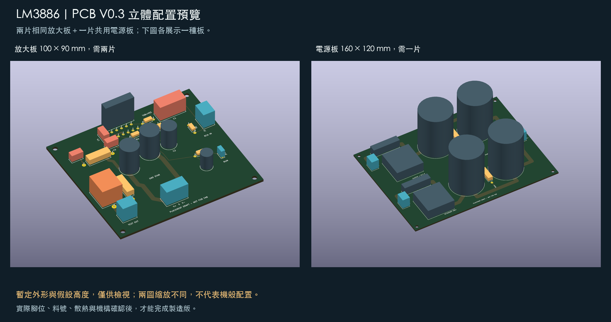

# 變更紀錄

本檔集中原本散在 README.md 與 HANDOFF.md 的逐日進度紀錄，新的在上。
現行狀態看 [README.md](README.md)，接手工作看 [HANDOFF.md](HANDOFF.md)，採購看 [docs/00-採購總表.md](docs/00-採購總表.md)。

紀錄一律保留當時的措辭與限制聲明；日期後面的段落不代表現在仍然成立，只代表當天做了什麼。

---

## 2026-10-03：PCB V0.6.1 走線加寬候選（分支 `v061-layout`，未併 main）

- 使用者問「V0.6 走線能不能再粗一些、減少電阻」。先用 `analyze_pcb_v03` 的模型算 V0.6 兩板 23 條載流路徑：每條 2–30 mΩ（1 oz），對喇叭 8 Ω、變壓器二次側 0.25／0.2 Ω、繼電器接點都是零頭；但放大板負電源腳間線 0.5 mm（占該路徑 54 %）與電源板 AC 回線（−）2.0 mm 明顯比同類細。使用者決定做 **V0.6.1**：零件、擺位、板尺寸、102 機殼與 150×90×30 散熱器全部不動，只加寬。
- `tools/pcb_layout_v061.py` 匯入 V0.6 定義，依 (網路, 群組, 原寬) 表覆寫寬度：放大板 負電源腳間線 0.5→0.9（焊盤 1.8／腳距 3.4 的硬上限 1.0，腳 3 輸出短線 2.0→1.8 才夠 0.3 間距）、腳 1／5 底層短線 1→2、470 µF→IC 2→3／1.5→2.5、饋線 3→4（負饋線只到 3.5，x=58 夾在 C5 與 C2.2 之間）、輸出主幹 3→4 並把兩個轉折點左上移 0.6 避開 VCC 饋線（Zobel 饋線改接新頂點，T 接點不算連接）；電源板 主幹 3→5、VEE 輸出 2.5→4、AC 回線（−）2→4、星點 3→4（5 會離 R202.2 只剩 0.30）、進 5.08 端子焊盤的末段維持 3。
- DRC：放大板首輪 0 錯誤；電源板首輪 2 錯誤（POS_AC2 的 5.0 端蓋在 (13.5,112.5) 壓到 J201.1 焊盤）→ 寬段改從 y=110 起 → 0 錯誤、0 未連通。`verify_pcb_v061.py` 通過；`analyze_pcb_v061.py` 出 V0.6 vs V0.6.1 對照表（放大板負電源 29.8→18.5 mΩ、電源板主幹 −40 %、AC 回線（−）−50 %、23 條合計發熱 1.99→1.23 W），寫進 pcb/README「PCB V0.6.1」節與 `current-budget-v061.json`。回授線長與 V0.6 相同。
- 另提醒：訂板選 2 oz 可再把全部數字減半，含改不寬的腳間線。**待使用者看圖決定是否併入 main。**

## 2026-10-02（凌晨）：放大板與電源板 PCB V0.6——V0.6 五板齊，機箱 3D 換成真板

- 使用者決定不等 IC 實量與機殼內寬，先以型錄規格畫。**放大板 `mono-layout-v06` 90×80**：U1 改用 KiCad 函式庫 `TO-220-11_P3.4x5.08mm_StaggerOdd_Lead4.58mm_Vertical`（複製成 `LM3886T_TO220-11`，背板在奇數腳後 9.58 mm、偶數腳前 5.08），放在 y=9.58 使背板與板邊齊平（方案 B）。IC 上方不能走線：Kelvin 改底層 y=17.5、靜音線從腳 7／9 間下來走 y=12、L_PLUS 的 R6→R2 段改底層跳過靜音線、pin 1／5 V+ 用底層 1 mm 短線在兩排腳之間相連（KiCad 不把同網路焊盤視為相通，V0.5 的頂層跳線拿掉後曾出現未連通）。板 90×90→90×80，J2／J5／R8／C8／JP1 上移、C2 到 y=52（避開 C6 外框）。DRC 三輪→0 錯誤。
- **電源板 `psu-layout-v06` 92×120**（原目標 87 放不下兩欄 Ø35 加 10 mm 洩放電阻縫，加寬到 92，機殼寬餘裕夠）：正欄 x=21、負欄 x=71，四顆都轉 180 讓正極在內側；VCC 頂層 x=26、GND 底層兩欄＋底層 y=78 星點連線、VEE 頂層 x=66；左輸出 VEE 走底層 y=24.5 繞過 VCC 匯流；GBJ 轉 180 放 y=90（散熱片朝保險絲），保險絲 y=106.5、AC 端子 y=116、直流 3P 端子後緣 y=4。**snubber 預留位未上板**（verify 列出 C207–C210／R203／R204 未放）。DRC 三輪→0 錯誤。
- 工具：`pcb_layout_v06.py`、`build_pcb_v06.py`、`verify_pcb_v06.py`（含 U1 背板貼邊、GBJ +y 側散熱片包絡）、`render_pcb_v06.py`（五板同比例 `system-layout-v06.png`）。
- **3D**：`draw_chassis_scene_v06.py` 改成五塊板都吃 STL，`place_board(name, origin, rot)` 只用純旋轉——發現前一版把右聲道放大板畫成鏡像是不可能的實體：同一塊板轉 180° 貼右側散熱器後 **RCA 端子會在前側**，右聲道輸入線要沿板邊拉約 90 mm（或日後另出鏡像板）。
- pcb/README「PCB V0.6」擴成五板現行、V0.5.1 退歷史；tools/README、HANDOFF、README 同步。

## 2026-10-01（深夜 2）：控制板 CTRL 與市電板 MAINS 的 PCB V0.6、弘宙 102 機箱 3D 配置

- **原理圖微調後再畫板**：繼電器全部改 Omron **G2RL-1-E**（低背 16 A、線圈 33 mA；KiCad 函式庫有封裝與 3D 模型，G2R-1-E／G5LE-1 沒有或腳位不確定）；輔助電源橋 DF06M 改成 **1N4007 ×4**（D306–D309，封裝無疑義）；光耦改 **SFH617A-3**（DIP-4，Vceo 70 V；H11D1 是 6 腳）；pin 6 與 D301 節點補標籤 RLYDRV／ACSENSE。ERC 仍 0。
- **PCB**：`tools/pcb_layout_v06_ctrl.py`＋`build_pcb_v06_ctrl.py` → `pcb/ctrl-layout-v06`（70×120，49 件）與 `pcb/mains-layout-v06`（70×100，11 件）。封裝：G2RL／SIP-8／DIP-4／TO-92 wide／TO-220／DO-41／DO-35 由 KiCad 函式庫複製進 DraftV03.pretty 並把焊盤編號改成腳名（G2RL 的 11→COM、14→NO、刪 12；每個觸點兩個焊盤要用短線相連，KiCad 不把同號焊盤視為相通）；TO-92 窄版 1.27 間距過不了 0.3 mm 間隙規則，改 wide 版。DRC 三輪→兩板 **0 錯誤、0 未連通**（剩絲印警告）。`verify_pcb_v06_ctrl.py`：MAINS 市電／低壓銅箔最小距離 7.25 mm（L_IN 焊盤 vs TRIG_P 走線）。
- **3D**：`tools/draw_chassis_scene_v06.py`（pyvista，`py -3.13 -m pip install pyvista`）：kicad-cli 匯出 CTRL／MAINS STL（含函式庫模型；G2RL 模型未隨 KiCad 安裝，以方塊補），散熱器 150×90×30、變壓器、放大板與電源板 V0.6 目標外形示意 → `docs/diagrams/chassis_102_v06_3d.png`（等角＋俯視）。**座標教訓**：2D 配置圖的 x（從正面看的左右）在 VTK 右手座標要鏡射 x 才一致；kicad-cli STL 的 Y＝−板 y、板頂 z=0。另輸出 .gltf（.gitignore）。
- **配置修正**：102 多出的寬度不能分到散熱器與放大板之間——IC 要直接鎖散熱器底板，放大板必須緊貼散熱器區（x 55）；餘裕只放在放大板與電源板之間（各 18）。前一節的「四個縫各 9」作廢。
- pcb/README 新增 V0.6 節；tools/README 新增 V0.6 家族；HANDOFF 現況與下一步更新；.gitignore 補 gltf 與 STL 目錄。

## 2026-10-01（深夜）：機殼改向弘宙 102、散熱器內置、控制／保護板第一版原理圖

- **機殼**：使用者決定「先挑殼、散熱器放殼內、以現有零件重排 PCB」。依型錄（雙面板前附把手 1 series）比較 103（d355×c285×e105）與 102（d395×c290×e105），**選 102**：內尺寸估 393×273×100。配置圖（本場 scratchpad，尚未進 repo）：後排 放大板 L 80×90｜電源板 87×120｜放大板 R 80×90，變壓器前排中央，控制板 70×120 平放左側、市電板右側；三板目標尺寸對 103 也成立，102 多出的 40 mm 分成四個縫。合板（每聲道放大＋電容）在這兩個殼都塞不下，不採用。CASE106（內 230×165）判定不可能。
- **散熱器規格改為 8 Ω 連續正弦**（使用者選）：Tj 125 − Ta 40 = 85 K、Pd,max 34 W（±33.5 V／8 Ω）→ θSA ≤ 1.2 °C/W；估法 θSA ≈ 1000／表面積(cm²)（±30%）。買 150 長 × 90 高 × 30 深黑色鋁擠 ×2，鰭片朝牆、底板朝板、每側含空氣通道吃 53–55 mm，上蓋與底板須開通風孔。原 0.4 °C/W 是 ±41 V 前提下的保守值。
- **控制／保護板原理圖第一版**：新增 `tools/build_control_board.py` → `electrical/control-v01.kicad_sch`（CTRL，46 件）與 `electrical/mains-v01.kicad_sch`（MAINS，11 件），兩張 ERC 0 違規，預覽在 `electrical/preview/`。決定：自製、UPC1237 晶片（UTC QW-R107-065.B）、Omron G2R-1-E 12VDC ×3（K_SPK×2、K_BYP）＋G5LE-1 12VDC（K_TRIG）、Ametherm SL22 10005 NTC、兩塊板。與 docs/14 §3 的差異：解除靜音綁在喇叭繼電器（光耦 LED 由 RLY 節點供電），不另做 1–2 s 計時；UPC1237 以 +12 V 供電而非型錄 25–60 V（pin 8 為 3.4 V 參考，R301 3.3k 給 2.6 mA）；pin 6 經 PNP 推兩顆線圈（88 mA > 80 mA 上限）；K_BYP 計時用 TL431 當比較器（220k／22µ，約 1.1 s）。全部為第一版數值，無量測。
- `build_schematic.py`：Drawing 增加 date／rev／comment 欄位；盒狀符號（Relay、UPC1237、Opto、Reg78、TL431、PNP、NPN）的參考與數值文字改放符號上方。`.gitignore` 補 `electrical/*-erc.json`、`*-netlist.xml`。
- 繼電器 DC 分斷：docs/14 要求 ≥36 VDC／9 A，市售小型繼電器找不到；使用者接受 G2R-1-E 的 30 VDC 等級（故障時 33.5 V／8 Ω 4.5 A 一次性分斷）。

## 2026-10-01（傍晚）：repo 整理——文件對齊 V0.5.1、版控雜物清掉

- **HANDOFF.md 整份重寫**：原「下一步」是 9 月累積的 1–7＋5b＋5c，仍寫著「整流橋 KBPC2510 鎖機殼定案」「機殼未選定」「LM3886T 到貨未回報」等已作廢內容；改成 2026-10-01 現況＋七步順序待辦＋V0.5.1 重建指令＋分支說明，逐日細節全部交給本檔。
- **tools/README.md 整份重寫**：原本停在「PCB V0.3（現行）」，v04／v05／v051 共 24 支腳本沒列；改成按版本家族列出，並註明 `mains_budget.py` 輸出到 stdout（docs/06 早已併入 docs/05）。
- README 目錄表「PCB／PCB 看圖資料」兩列改指 V0.5.1 與 inspection-v051；docs/diagrams/README 補註六張圖對 V0.5.1 仍適用（電路未變，只有橋堆線束那段不存在）。
- **版控**：`.gitignore` 漏加 v051 那段，使 `pcb/inspection-v051/3d/` 的 24 個中間產物（`models/*.wrl`、`*-preview.kicad_*`、`raw-*.png`）被 commit 進來；補規則並 `git rm --cached`（磁碟上檔案保留）。已併入 main 的本地分支 `v04-layout`、`v05-layout` 刪除；`v052-layout`（未採用合板候選）依使用者決定保留。
- 使用者指出 README 首頁「目前狀態」標題仍是 09-24、系統圖仍是 V0.5：狀態節重寫為 2026-10-01 現況；`render_pcb_v051.py` 加系統視圖 `pcb/preview/system-layout-v051.png`（兩片放大板 D＋V0.5.1 電源板，同比例），README 與 pcb/README 首圖改用它。
- 無電路、板檔、估算變動。

## 2026-10-01（下午）：PCB V0.5.1——電源板整流橋 GBJ2510 直立上板，併入 main

- 使用者問整流橋能否放回電源板。查原廠：GBJ2510（Diodes DS21221）直立 30×20×3.8、扁腳 1.0×2.2、腳距 10／7.5／7.5、腳序 ＋ ～ ～ －、IFSM 350 A、RθJC 1.0；KBPC2510W（Goodark）28.5 mm 方塊、Ø1.0 圓腳間距 17–19，塞不進 V0.5 上緣 27 mm 條帶。建議 GBJ2510，使用者選定。
- 新封裝 `GBJ_Upright_P10_7.5_7.5`（`build_pcb_v051.py` 的 `make_fp_oval`，長孔 2.6×1.4、焊盤 3.8×2.6，絲印標 ＋～～－ 與散熱面粗線）；`pcb_layout_v051_psu.py` 由 V0.5 衍生，只覆寫 BR1 (19,23,0)、BR2 (81,23,0) 與進出整流橋的七條走線。BR2 不像 V0.5 旋轉 180（否則金屬背朝電容），右半另佈。板 125×130 不變。
- DRC 兩輪：第一輪 2 條絲印重疊（HS 字壓到散熱面標線，上移 0.6），第二輪 0 違規 0 未連通。`verify_pcb_v051.py` 另檢查橋體與 10 mm 散熱片包絡不撞任何零件（離保險絲座 1.0、離電容外框 1.5 mm）。預覽 `psu-layout-v051.png`、對照 `psu-layout-v051-compare.png` 傳使用者，**使用者「我覺得 OK 可以 main」→ ff 併入 main，V0.5 電源板退為歷史、放大板 D 沿用。**
- `pcb/inspection-v051/` 由 v05 六支腳本衍生（GBJ 高度假設 20 mm）：正反面／組裝／3D／零件核對重做並通過驗證。
- 採購：docs/00 §2.1 新增 GBJ2510 ×2 與小散熱片＋M3 固定件兩列（散熱片選法：鋁鰭片寬 ≤30、厚 ≤10、高 25–35、M3 孔，估 8–12 °C/W），KBPC2510／M5 固定件／Faston 線三列作廢；§1.1、§3、docs/05、README、HANDOFF 同步。

## 2026-10-01：變壓器電氣實量（直流電阻、空載電壓、線色分組、標籤電流）

- 使用者以三用電表量測並手寫記錄（`docs/photos/20261001-transformer-electrical.jpg`）：一次側 R／B 線 DCR 約 1.9–2.0 Ω（讀值已扣表筆）；12V 繞組 Y／Y 空載 12.27 Vac、0.4 Ω；22V 第 1 組 G／B 空載 22.29 Vac、0.25 Ω；22V 第 2 組 B／B 空載 22.29 Vac、0.2 Ω；兩組 22V 中間接在一起後 G 到另一端 B 讀 44.6 Vac、串接 DCR 0.4 Ω，確認兩組同相可當 22-0-22。電壓以 1 kΩ 假負載量，等同空載。
- 標籤抄錄：22V 4.2A×2、12V 1A ⇒ 約 197 VA（手寫判讀 4.2，待再核對）。由此初定保險絲提案：一次側 T2.5A（有軟啟動）或 T3.15A、22V 各 T5A、12V T1.25A。
- 由直流電阻推估滿載銅損約 15 W、每組 22V 調整率約 7–8%；與「空載只比標籤高 1.3%」對不上，可能原因是量測時市電低於 110 V。**量測當下市電未記**，下次量要同時量市電。若當時為 110 V，最壞情境軌電壓由 ±35.8 降為 ±33.5 V；市電對照量出前，選料仍以 ±35.8 V 核對。
- 第 2 組 22V 兩條線都記為 B（黑／藍／棕未分），裝機前要再用導通表分一次。仍未做：帶載電壓、繞組間絕緣（應 OL）、溫升、熱保護。
- 寫入 docs/00 §1／§2.1 保險絲列／§3／§4、docs/05 主電源接法、README 狀態列。電路、板檔、估算腳本未動。
- 同日稍後使用者補答：量測時市電 110 V；標籤確為 4.2 A；22V 兩組線色為綠／綠與藍／藍（手寫稿的 G／B 是串接兩端）。據此把最壞情境軌電壓由 ±35.8 修正為 ±33.5 V（空載值已實測，不再疊 +8% 調整率），帶載推估連續雙聲道正弦約 30–32 W／8Ω、音樂瞬間 40 W 可達。選料結論不變。
- 核對後補修：docs/00 §3 去掉「市電對照未量」、§2.2 控制板零件列改為可開始篩選（兩軌儲能 25.6→22.4 J）；docs/14 湧浪情境表帶入實測繞組電阻（次級迴路約 0.3 Ω，對應第一列約 11×）、§8 待量表標注已量與未量項。
- 使用者問整流橋可否開買：以實測核 KBPC2510（反向峰值約 63 V／1000 V、平均直流約 2.5 A／25 A、湧浪約 100 A／300 A、每橋耗熱約 4–5 W）⇒ 可買；Faston 線定 AWG18（或 16）。docs/00 §2.1 兩列、§3、docs/05 同步。

## 2026-09-29（深夜）：目標喇叭 Usher Be-718 匹配估算寫進 docs/01

- 使用者告知目標喇叭為 Usher Be-718（先前未記錄在 repo）。查原廠規格與 Stereophile／Sound & Vision 實測：標稱 8Ω、低中音 >6Ω、最低 5.16Ω @2.8kHz、靈敏度實測約 85dB。
- 結論：阻抗與電流無虞；±30V 散熱可以、±36V 連續 6Ω 正弦會超溫（要實測）；音量偏緊（本機約 36W vs 原廠建議 80–200W，一對 2.5m 房間削波前約 98–99dB）。全為計算。

## 2026-09-29（晚）：PCB V0.5 候選——為塞進 BZ4312A2 縮板，DRC 0

- 起因：BZ4312A2 配置 A 下，V0.4 三板深度只剩 7 mm、前排寬只剩 30 mm。結論是三板架構不用重做（IC 必貼側牆、重物必在前排），只改兩塊板的形狀。
- 放大板 D 115×90 → 90×90：C2（EGW 47µF）躺式改站立（新封裝 `BP_Axial_Vert_D20_P15`，腳距 15 為假設）、R1／C1 直立、J1 內移、靜音零件搬到右下、L_MUTE 沿上緣與右邊繞行。IC 區、輸出區、回授網路座標不動。
- 電源板 160×120 → 125×130：AC 區搬上緣、輸出區搬下緣、電容兩欄各下面一顆轉 90°、洩放電阻進欄間空隙、snubber 預留位貼左右邊。更正：四顆電容本來就是 2×2，160 寬是兩側端子區造成的。
- 新增 `tools/pcb_layout_v05.py`／`pcb_layout_v05_psu.py`／`build_pcb_v05.py`／`verify_pcb_v05.py`／`render_pcb_v05.py`／`draw_chassis_fit_v05.py`；產出 `pcb/*-v05*`、`validation-v05.json`（含機殼餘裕：深 7→22、前排寬 10→45）、`docs/diagrams/chassis_bz4312a2_v05_fit.png`。
- DRC 三輪：H2 固定孔壓 C1 保留區、C205／C206 與大電容保留區重疊、R1 與 R2 保留區重疊、VEE 短樁頂到 VCC 匯流；第三輪兩板 0 違規 0 未連通。
- 使用者看預覽後選定，同晚 ff 併入 main 成為現行版本；V0.4 退為歷史。`pcb/inspection-v05/`（正反面、組裝、3D、零件核對）由 v04 腳本衍生重做，驗證通過。U1 未動，IC 方案 B 等三項實量。

## 2026-09-24（深夜）：PCB V0.4 放大板變體 C 畫好、DRC 0

- 新增 `tools/pcb_layout_v04.py`／`build_pcb_v04.py`／`verify_pcb_v04.py`／`render_pcb_v04.py`，產出 `pcb/mono-layout-v04c.*`、`mono-v04c-drc.json`、`validation-v04.json`、預覽圖。電路與封裝沿用 V0.3，只改位置與銅箔。
- 五點改法（旁路貼腳、470µF＋STAR 上移、J1 並排走線＋SG、Zobel 直入 STAR、C2 平放右半）落地；C3／C4 接地路徑 24／33→5／11 mm，Zobel 接地 72→12 mm，過孔 3→0。回授取樣線 7→50 mm、訊號地變長，是有意的代價，已寫在 pcb/README。
- DRC 三輪：第一輪 3 錯（靜音供電與 L_MUTE 交叉、VEE 主幹與 C2.2 間距 0.2、C2 與 C6 保留區重疊）＋絲印警告；第二輪 3 錯（C8 回地線壓到 JP1.2、R8 與 C8 保留區重疊）；第三輪 0 違規 0 未連通，分路檢查通過（匯合半徑 5 mm）。
- 變體 D、電源板 V0.4 PCB 未畫；V0.3 板檔與雜湊未動。

---

## 2026-09-24（深夜）：修正兩張導讀圖的 PyMuPDF 渲染錯誤

- `lm3886_input_stage.png`／`lm3886_ic_to_output.png` 前一筆 commit 的版本是壞的：PyMuPDF 不支援巢狀 `<svg viewBox>` 與 `clip-path`，子圖被畫在原點且蓋住標題。`build_diagrams.py` 的 `embed()` 改成明確的 translate/scale 群組並去掉子圖底色，兩張圖重建；其餘圖不受影響。

---

## 2026-09-24（深夜）：單聲道完整接線圖、電源板原理圖預覽同步、導讀圖重建

- 使用者指出原理圖看起來不完整：KiCad 圖以網路標籤代替畫線，且電源板預覽 PNG／PDF 是改 J204／snubber 之前匯出的。重新匯出 `electrical/preview/internal-psu-v02.pdf/.png`（ERC 0）。
- 新增 `tools/build_diagram_full_v04.py` → `docs/diagrams/lm3886_full_v04.png`：放大板 D 22 件＋電源板 22 件全部以實線畫出（電源、去耦、靜音、回授、Zobel、J5↔J203 線束、J204），元件編號＝板上絲印。
- `build_diagrams.py`：舊「完整電路總覽」停產並移到 `docs/diagrams/archive-v03/`；其餘五張重建，色塊圖彩色框依新 PDF 版面重新對位，文字改 V0.4／到貨現況；`render_diagrams.py` 以 PyMuPDF 取代 sharp。`sources.json` 重綁。

---

## 2026-09-24（深夜）：V0.4 的 3D／正反面／組裝圖與零件核對表

- 新增 `pcb/inspection-v04/`（放大板 D＋電源板）：正反面銅箔 SVG／PNG（D 的背面圖畫出鋪銅）、組裝極性圖、逐腳對照、KiCad 原生 SVG、六張 3D 算繪＋總覽、`parts-audit.md/json`（44 列，含 snubber 預留位與 J204）。
- 工具 `tools/*_inspection_v04.py` 由 V0.3 版衍生；SVG→PNG 改用 PyMuPDF 取代 node／sharp。`verify_pcb_inspection_v04.py`（KiCad Python）通過：preview 板只多模型節點、22＋22 模型外框、54＋50 焊盤網路對照。中間產物加入 .gitignore。

---

## 2026-09-24（深夜）：V0.4 併入 main，V0.3 退為歷史版本

- 新增 `pcb/preview/system-layout-v04.png`（兩片 D＋電源板 V0.4）。README／pcb/README／HANDOFF 改為「V0.4 現行、V0.3 歷史」，V0.3 檔案與雜湊原樣保留。`v04-layout` 以 fast-forward 併入 `main`。

---

## 2026-09-24（深夜）：放大板選定 D 為主、C 保留；D 輸出主幹改頂層

- 使用者看過三張預覽後決定以變體 D（整面接地）為主要方案，C 板檔保留。
- D 的輸出主幹與 Zobel 接線改頂層、C7→pin 1 的 V+ 改底層、拿掉 C3.1 的多餘 V+ 分支；底層鋪銅單一連通區、左半不再靠窄帶相連。DRC 0 違規、0 未連通，`verify_pcb_v04.py` 三板通過並重綁雜湊。

---

## 2026-09-24（深夜）：PCB V0.4 電源板畫好、DRC 0，三塊板齊

- 新增 `tools/pcb_layout_v04_psu.py`，`build_pcb_v04.py` 一次建三板。電源板加 J203／J204 每聲道 3P 端子（STAR 移到端子旁）、每繞組 snubber 預留位一列（只留孔）。
- DRC 第一輪 1 錯（負半邊 snubber 回線壓到 V- 充電線）＋絲印警告，改線位後 0 違規 0 未連通；`verify_pcb_v04.py` 三板通過並綁定雜湊；`render_pcb_v04.py` 出三張圖。
- 放大板 C／D 板檔未變（生成器重跑只動 UUID，已還原）。

---

## 2026-09-24（深夜）：PCB V0.4 放大板變體 D 畫好、DRC 0

- `pcb_layout_v04.py` 加 `AMP_D`（座標與 C 相同、拿掉 GND 分路、加底層 GND 鋪銅）；`build_pcb_v04.py` 加 zone 建立與 `ZONE_FILLER` 填銅、填銅多邊形寫進 JSON；`render_pcb_v04.py` 畫鋪銅；`verify_pcb_v04.py` 對有鋪銅的板改檢查連通區數。
- 變體 D DRC 0 違規、0 未連通，鋪銅單一連通區。變體 C 檔案未變（重跑生成器只動 UUID，已還原）。
- 電源板 V0.4 PCB 仍未畫。

---

## 2026-09-24（晚）：整流橋裝法定案為鎖機殼

- 產生 A（KBPC2510 鎖機殼、板上 4 位端子）與 B（KBPC-W 線腳版焊板）兩張電源板預覽，皆 DRC 0；使用者選 A。
- `BridgeTerminal4_P5.08` 取代 `Bridge_LOGICAL_UNVERIFIED`；四條橋堆進出線加轉折點；電源圖註記更新；採購總表 §1.1／§2.1 改寫，新增 Faston 母端子與線材項；HANDOFF 步驟 2 更新。
- 電源板重建、DRC 0、驗證通過；`analyze_pcb_v03.py` 重算。3D／導讀圖仍未重建。

---

## 2026-09-24：原理圖與 PCB 在本機重建

- 發現這台 Windows 其實裝有 KiCad 10.0.6（不在 PATH），先前「本機無 KiCad」判斷錯誤。在 `core.autocrlf=false` 的 clone 中重建，Python 文字寫檔強制 LF。
- 原理圖：兩份 ERC 0 違規；`verify_electrical.py` 期望值改為實購（C1／C3／C4／C8 100V、R8 0.6W），核對通過。本機無 pdftoppm，預覽 PNG 以 PyMuPDF 轉出（2400 px 長邊）。docs/02 重算結果無變化。
- PCB：首輪 DRC 3 項（C2／R1 保留區重疊、U1 絲印字高與壓字），驗證抓到 C2 訊號地與靜音回流相碰；修正見 pcb/README。最終兩板 DRC 0 違規、0 未連通，`verify_pcb_v03.py` 通過，`analyze_pcb_v03.py` 重算、單元測試通過，預覽圖重繪。
- 工具：`build_pcb_v03.py`／`run_pcb_drc_v03.py` 把 KiCad 在 Windows 寫出的 CRLF 轉 LF 後才雜湊；四支腳本的雜湊路徑改 `as_posix()`，避免 Windows 反斜線路徑。
- 自我複核後補修：系統預覽圖與電源圖上的「待到貨／C2 立式改臥式」過期字樣、pcb/README 的 R3.1–C2.2 距離改為實算 10 mm、機殼寬度需求標註待重算（原以 100×90 推導），並註明 C2 本體下方有走線與過孔。
- **未重建**：`pcb/inspection-v03/`（3D、parts-audit）與 `docs/diagrams/`。

---

## 2026-09-23：到貨件初量，C2 改躺式、放大板加寬

- 使用者實量（尺量／目測，非卡尺）：變壓器 Ø約120、本體含出線鼓起約 50 mm、中心開孔約 Ø40、出線 8 條各約 30 cm；CDE 381LX Ø約35×50、2 腳、腳距約 10，印字 10000µF／63WV／+105°C／8040，殼上無完整料號；ROE EKE 470µF Ø約12×25、腳距約 5、腳徑約 0.8；ROE EGW 47µF 軸向約 40×Ø20、腳徑約 0.8–1.0。寫入 docs/00 §1／§1.1。
- 使用者決定 EGW 躺著裝、放大板加寬。新增 `BP_Axial_L40_D20_P50`；`pcb_layout_v03.py` 放大板 115×90、C2 移至 (72,80) 轉 90°、R8／C8／JP1 右移、三段走線改道；`CP_D12.5_P5` 鑽孔 0.9→1.0；預覽圖尺寸文字與系統圖位置同步。
- **板檔、DRC、預覽圖、parts-audit 皆未重建**（當時誤以為本機無 KiCad；9/24 已重建板檔）。自寫座標幾何檢查無新增違規，不取代 DRC。兩片放大板加寬後，機殼內寬需求增加約 30 mm，機殼估算待重算。

---

## 2026-09-22（晚）：變壓器與 yosontw 40 件到貨

- 使用者回報：環形變壓器與 9/20 露天 yosontw 訂單（電阻、WIMA、CDE、ROE 共 40 件）已到家。**尚未開箱核對、未量測。** LM3886T 到貨與否未回報。
- 狀態同步：docs/00 §1、README、HANDOFF、10-planned-parts.json（`delivered_2026-09-22_unmeasured`）、parts-audit 採購狀態欄。無其他變更。

---

## 2026-09-22（下午）：V0.4 進入設計草案

- 新增 `docs/14-V0.4-控制與保護板設計草案.md`：一片控制板整合軟啟動旁通、喇叭 DC 保護、靜音接管、Z10 trigger、12Vac 輔助電源；系統方塊、啟停時序表、與 V0.3 三板的介面表、繼電器採購篩選清單、變壓器到貨量測清單、UPC1237 模組驗證清單。
- 新增 `tools/control_budget.py`（純標準庫）：儲能／湧流情境、R_s 選值與失效功率、K_SPK DC 分斷需求（≥36V／≥9A）、掉電時序（軌壓 1s 內 >20V vs 釋放 <60ms）、12Vac 預算（140mA、2.7VA、7812 餘裕 0.4V）、靜音電流核對、trigger 直驅門檻（線圈 ≥240Ω）。
- 決定：K_TRIG 線圈由 Z10 12V 直接供電，不做待機電源；掉電取樣點在 12Vac 整流前；靜音由控制板每聲道獨立元件接管。
- 沒有原理圖、PCB、BOM；放大板與電源板電路不變。README／HANDOFF／13／00／tools README 加連結。

---

## 2026-09-22：圖片與採購資料同步到 9/20 下單後狀態

- **導讀圖六張重建**（`tools/build_diagrams.py`）：C1／C3／C4／C8 耐壓改為實購 100V、R8 改 0.6W；「僅變壓器與 IC 已訂」「四顆主電容未購」等過期文字改為現況；修正放大板色塊圖橙框遮住 R4 標籤、電源圖 GND 註記壓線；IC→輸出圖頁尾指向已不存在的 `pcb/review-v03.md` 改為 `pcb/README.md`。`sources.json` 改為只綁生成器與 PDF（sch 每次重建 UUID 都變，雜湊不可重現）。
- **PCB 預覽圖重繪**（`render_pcb_v03.py`）：標題「B 方案」改為「方案 C PCB V0.3（布局 B）」，副標「已訂 IC 與變壓器均在寄送中」改為現況。走線 JSON、板檔、DRC 未動。
- **原理圖生成器改值但未重建**：`build_schematic.py` C1／C3／C4 → 100V、C8 → 100V、R8 → 0.6W、title block 移除「no PCB」；`build_power_supply.py` 的「NOT purchased」註記改為 381LX 已購。**`.kicad_sch`／PDF／PNG／BOM／validation.md 仍為 9/16 產物**，等封裝改完在有 KiCad 的機器一起 `rebuild.py`。
- **採購總表**：補 CDE 361R／381LX 型錄尺寸（361R EG 殼 Ø12.5×20／P5 → C8 封裝必改；381LX A05 殼 Ø35×50，但 **A052 料號不在現行型錄**，63V／10,000µF 只有 Ø30 K 殼）；補四項漏列（橋堆固定件、環形變壓器固定件、熱縮套管、假負載散熱片）；加 2.1／2.2 小計；0.7µH 電感改建議自繞、露天品降為備選；購買順序第 2 步改為先用型錄值估機殼。
- **機器可讀資料**：`10-planned-parts.json` 全部項目由 `planned_not_ordered` 改為已下單待到貨，Mundorf／NCC 標為未選；`11-ruten-shopping-links.json` 修正 KF301 2P 數量說明、新增四項「候選待找」。
- **PCB 核對資料**：`build_pcb_inspection_v03.py` 依實購料件逐項寫入採購狀態，重跑產生 `parts-audit.json/md`；`*-footprints.csv` 與 `build_pcb_v03.py` 的狀態字串同步；`inspection-v03/verification.json` 的檔案雜湊手動重算並註明。
- **型錄比對（採購總表新增 1.1）**：查 TI、EIC、WIMA、Vishay、CDE 原廠文件逐項對現板封裝。新發現：LM3886T 鑽孔 0.9 mm 小於腳寬 0.97 mm 必改；KBPC2510 是 Faston 端子，`Bridge_LOGICAL` 的 1.5 mm 孔兩種裝法都不合，要先決定鎖機殼或改 KBPC-W；WIMA／Vishay 六款全部相容。只改 00 總表、HANDOFF、本檔，沒動封裝庫與 PCB。
- **依型錄改封裝庫與生成器（板檔未重建）**：`build_pcb_v03.py`＋`DraftV03.pretty` 的 `LM3886T_UNVERIFIED` 鑽孔 0.9→1.1／焊盤 2.0，`CP_D35_P10` 鑽孔 1.3→2.5／焊盤 4.0；`pcb_layout_v03.py` C8 改 `CP_D12.5_P5`；`build_pcb_inspection_v03.py` 3D 高度 Film_P15 15、Film_P5 6.5、LM3886T 22。C2 臥式待 ROE 實測。
- 沒有改電路、走線、元件值（僅耐壓／功率額定向上對齊實購件）；沒有硬體量測。

---

## 2026-09-21：大幅精簡文件與檔案

- **刪除 `pcb/archive/`、`tools/archive/`、`docs/archive/`**（含 2026-09-20 剛歸檔的六份採購附錄與 2026-09-11 舊完整 PDF）。**檔案沒有消失，最後包含它們的 commit 是 `41b217c`，用 `git show 41b217c:<路徑>` 或 `git checkout 41b217c -- <路徑>` 取回。**
- **例外保留** `pcb/archive/v02/mono-layout-v02.json`、`pcb/archive/v02/psu-layout-v02.json`：`tools/analyze_pcb_v03.py` 的 `layout_path()` 讀這兩個檔做 V0.2→V0.3 載流對照，刪掉會讓比較表壞掉。
- 合併文件：07 Z10 介面 → 01 設計規格；06 市電與電源估算 → 05 內建電源與機構；`pcb/README-v03.md`＋`pcb/review-v03.md` → `pcb/README.md`。13 喇叭保護計畫縮到 60 行內。
- 精簡 `pcb/inspection-v03/`：刪掉六張 `raw-*.png`、兩組 `*-preview.kicad_pcb/.kicad_pro` 與 `3d/models/`（全部可由 `build_pcb_inspection_v03.py`／`export_pcb_inspection_v03.py` 重建），已加入 `.gitignore`。
- `docs/00-採購總表.md` 重寫為 150 行內：已買表、未買表、購買順序、相容性結論。

---

## 2026-09-20：第二批零件下單

- 使用者提供露天訂單截圖（yosontw，訂單 26092068825254，2026-09-20 結帳）：13 種 40 件 $2,238＋運 $60。內容＝採購總表第 4 節 9 項＋第 6 節 2 項＋第 5 節兩組的 ROE 選項（EGW 47µF ×2、EKE 470µF ×4）。
- **設計決策落地：** C2／C102 用 ROE EGW 47µF 臥式無極性；C6／C7／C106／C107 用 ROE EKE 470µF／63V。這兩項與 CDE 381LX、361R 的實體尺寸下單前都沒有，**到貨後量尺寸 → 改 `DraftV03.pretty` 封裝（C2 立式改臥式為必改）→ 重建 PCB**。
- 已更新 `docs/00-採購總表.md`（開頭新增下單紀錄表與到貨待辦、進度表狀態）、`docs/archive/08-採購狀態.md`、`README.md`。其餘文件（10、11）保留原候選紀錄未改。
- 未購項不變：整流橋、保險絲座／保險絲、電感、KF301 接頭、排針、RCA／喇叭端子、雲母片、絕緣套、導熱膏、散熱器、AC 入口、軟啟動、保護板、線材、假負載、機殼。
- 沒有改原理圖、PCB、BOM、3D；沒有重跑 ERC／DRC。

### 首頁同步紀錄（原 README「預計下單清單（2026-09-18）」段落，2026-09-20 更新）

已登記 Vishay／RNU2 電阻、CDE／WIMA 電容，以及 ROE／Mundorf／NCC 替代候選。**2026-09-20 已下單（露天 yosontw，40 件 $2,298 含運）；47µF 選 ROE EGW、470µF 選 ROE EKE。** 查看數量、價格試算與封裝影響（`docs/archive/10-預計下單清單.md`，已刪除）。現有PCB與3D尚未按這批料件定版。

---

## 2026-09-19：封裝絲印組裝標記

- 新增 `tools/silk_marks_v03.py`（純 Python，無 pcbnew 依賴），`build_pcb_v03.py` 的 `make_fp` 於存檔前呼叫它，為 `CP_*` 電解加「+」與負極條、為 `LM3886T_UNVERIFIED` 加 pad 1 標記與散熱片側標線／字樣。
- 同步以相同幾何手動寫入 `pcb/DraftV03.pretty/` 四個 `.kicad_mod`（每個新增 3 個 F.SilkS 項目，括號平衡已檢查）。**未改 `.kicad_pcb`、`.kicad_pro`、預覽圖與任何 DRC／驗證 JSON**，雜湊綁定不受影響。
- 極性核對來源：`pcb_layout_v03.py` 走線 —— C7 (VCC,GND)、C6 (GND,VEE)、C8 (GND,L_MUTE)、C201/C202 (VCC,GND)、C203/C204 (GND,VEE)，pad 1 一律為正。
- 驗證：`py_compile` 通過；`test_pcb_analysis_v03.py` OK。`verify_pcb_v03.py` 因缺 `electrical/netlist.xml`（需 kicad-cli 匯出）在改動前後同樣失敗，非本輪引入。本機無 KiCad，`PCB_TEXT` 於 footprint 內的 API 用法未實跑，重建時若報錯請優先檢查該兩行。
- **待辦（封裝定案後）：** J1／J2 極性標示、JP1（RUN）說明文字、全板零件值顯示。

---

## 2026-09-18：歸檔舊版板檔與腳本

- 依前輪議定執行，範圍只搬位置不刪檔，全部 `git mv` 保留歷史。`electrical/` 的 v01／v02 原理圖是現行檔案，未動。
- `pcb/archive/v01/`：`mono-placement-v01.*`、`psu-placement-v01.*`、`README-v01.md`、`Draft.pretty/`、`footprint-assumptions.csv`、`mono-drc.json`、`psu-drc.json`，以及 `preview/` 內三張 v01 PNG 與原本散在 pcb/ 頂層的 `mono-native.svg`、`psu-native.svg`（2026-09-16 產生，屬 V0.1）。
- `pcb/archive/v02/`：`mono-layout-v02.*`、`psu-layout-v02.*`、兩份 `*-footprints.csv`、`mono-v02-drc.json`、`psu-v02-drc.json`、`validation-v02.json`、`README-v02.md`、`DraftV02.pretty/`，以及 `preview/` 內五張 v02 PNG／SVG。
- `tools/archive/`：`build_pcb_draft.py`、`render_pcb_draft.py`、`build_pcb_v02.py`、`render_pcb_v02.py`、`verify_pcb_v02.py`、`pcb_layout_v02.py`。六支腳本的 repo 根目錄改為 `parents[2]`、輸出改指 `pcb/archive/v0X/`，並加註歷史腳本標頭；未在 KiCad 環境重跑。
- `docs/archive/`：2026-09-11 舊完整 PDF。README、HANDOFF 連結同步更新。
- **修正一個計畫沒列到的陷阱：** 現行 `tools/analyze_pcb_v03.py` 會讀 V0.2 板檔 JSON 做 V0.2→V0.3 對照，原本寫死 `pcb/`。已改為 `layout_path()` 依版本指向 `pcb/archive/v02/`；`current-budget-v03.json` 只改兩個來源雜湊的路徑鍵，數值未變（Python 3.14 重跑數值只有末位浮點差，未採用）。回歸測試 4 個通過。
- `pcb/fp-lib-table` 只保留 DraftV03；v01／v02 各自附一份 fp-lib-table 指向自己的封裝庫。三代板檔的 footprint 均無庫前綴，載入不受影響。
- 新增 `tools/README.md`：入口為 `rebuild.py`（只跑原理圖四支），其餘依用途分組。
- 驗證：全庫 Markdown 相對連結 0 斷裂；舊路徑字串 0 殘留；全部 .py 通過 py_compile。本機無 kicad-cli，`tools/rebuild.py` 未執行；`rebuild.py` 不引用任何被搬檔案。
- 沒有改原理圖、PCB V0.3、BOM、3D、PDF 內容；沒有重跑 ERC／DRC。

**順帶建議（未做）：** 03／08／09／10／11／12 六份文件的採購資訊仍散落，建議下輪做單一入口總表；README／HANDOFF 的逐日流水帳可移至 CHANGELOG.md。
（註：這兩項建議已分別於 2026-09-19 的 `docs/00-採購總表.md` 與 2026-09-20 的本檔落實。）

---

## 2026-09-18：docs 檔名中文化與機殼候選

- `docs/` 全部 12 份 .md 改為中文檔名（01-設計規格 … 12-機殼候選），編號前綴保留。`.json` 資料檔維持英文名，因為是腳本 I/O。
- 同步更新 README、HANDOFF、`docs/diagrams/README.md`、`electrical/README.md`、`pcb/README-v03.md`（已併入 `pcb/README.md`），以及 `build_project_pdf.py`、`rebuild.py`、`power_budget.py`、`mains_budget.py` 四支腳本內的檔名字串。全庫連結檢查 0 斷裂、0 處舊檔名殘留。
- 新增 `docs/archive/12-機殼候選.md`（已刪除）：由環牛 Ø120×43、電源板 160×120、放大板 100×90 與主電容尺寸推導最低內部空間（寬 ≥300／深 ≥250／高 ≥90 mm），列淘寶候選與商品連結。首選 4312A 兩側散熱 430×120×311（¥408）。
- **機殼未下單，散熱熱阻全部未標 °C/W，內部淨空間未向賣家確認，型號推測尺寸未經賣家背書。主電容料號未定前機殼高度不應定案。**
- 本輪沒有改動原理圖、PCB、BOM、3D 或 PDF，沒有重跑 ERC／DRC。

---

## 2026-09-18：露天商品連結

- `docs/archive/11-露天購物連結.md`（已刪除）整合38個已開啟核對的商品直達頁：原15項＋新增23項；docs/10的原表與JSON也補上連結／包裝選項。
- 47µF與470µF替代群組仍未決定，40個原需求位置不變；無代購、加購物車、已購或到貨狀態變更。
- 明列NCC店未含運$100出貨門檻、單件／10件／100件包裝，以及部分賣家二手以全新欄上架的公告。賣場規格只作候選，沒有原廠或真偽背書。
- 散熱器、介面、保險絲、軟啟動、喇叭保護板與假負載仍有關鍵缺項；市電電源線、PE接地組件等未核實項目在缺項表保留。
- 本輪僅文件／採購JSON更新；原理圖、PCB、3D、既有PDF及凍結inspection-v03未變。驗證38個唯一商品URL、15項／40位置與替代群組數量、相對文件連結及git diff；無重跑ERC／DRC。

---

## 2026-09-18：預計下單零件

- 使用者提供13列文字清單及2列截圖替代品；明確確認兩組皆列候選，尚未決定。沒有新增已購／到貨紀錄。
- docs/archive/10-預計下單清單.md／json保存15個候選條目、40個不重複元件位置、原文價格／出貨描述及完整料號。兩個替代群組不重複計量。
- 優先封裝影響：C2／C102改用臥式候選，NCC 470µF賣場Ø16與舊Ø12.5占位不同；CDE100µF與牛角主電容需原廠尺寸、接腳與孔徑核對。
- 本次僅更新採購與選料文件，未改原理圖、PCB、BOM電氣值或3D；inspection-v03仍為前次驗證快照，最新選料以docs/10為準。未重跑ERC／DRC或新增實測。

### 首頁同步紀錄（原 README「預計下單清單（2026-09-18）」段落）

露天商品直達連結與其餘待買候選（`docs/archive/11-露天購物連結.md`，已刪除）：已核對原15項候選及23項新增商品，附數量、包裝選項與尚待確認的規格。

---

## 2026-09-18：PCB A＋B＋C 看圖與核對

- 使用者選擇本輪 A（正反面與組裝）、B（3D）、C（零件／封裝表），並要求完成後推送 GitHub；這些字母不是更換電路方案。
- 基準為遠端 a71b2c4。新增 pcb/inspection-v03/：6 張導讀圖（PNG＋SVG）、4 份 KiCad 原生分層 SVG、2 份逐腳／極性表；底面銅箔以左右鏡像從板底觀看。
- 新增 15 種自建 VRML 暫定外框，覆蓋 22＋15 元件位置；衍生 preview 板僅添加模型引用。6 張原生 3D 角度圖及加框版本、總覽；可由 KiCad 3D viewer 旋轉檢視。
- 全部高度為顯示假設，不是原廠 CAD 或保證最大尺寸。IC 彎腳／背板、端子插線／工具空間、散熱器、機殼、焊錫與公差未建模；沒有 STEP 或製造檔。
- 37 項 parts-audit.json／md 列平面尺寸、假設高度、腳距、孔徑、採購狀態及核對欄位；料號、實物核對全部仍未完成。沒有新增到料資訊。
- 來源與驗證見該資料夾 README、sources.json、verification.json；以語法樹核對 preview 僅多 model 節點，原生讀取核對 89 個焊盤位置與網路，3D 模型尺寸與表格一致，圖面逐張檢視。沒有改原板／電路，也沒有重跑 ERC／DRC 或新增實測。
- tools/*pcb_inspection_v03* 與 write_pcb_parts_audit_v03.py 提供重建。preview 不是電路來源；後續先確定實際料號／尺寸再修改 pcb_layout_v03 及原板。

### 首頁同步紀錄（原 README「PCB 看圖與選料資料（2026-09-18）」段落）

已完成正反面銅箔圖、極性／組裝圖、兩板三種角度的 3D 預覽、可旋轉的 KiCad 預覽板，以及 37 項零件／封裝核對表。**元件模型採暫定外框與假設高度，尚非可製造裝配模型。** 原理圖與 PCB V0.3 走線保持不變。

[正反面、組裝與 3D 圖索引](pcb/inspection-v03/README.md) · [零件與封裝核對表](pcb/inspection-v03/parts-audit.md)

---

## 2026-09-17：六張電路導讀圖

- `docs/diagrams/` 六張 PNG 以同名更新，加入 SVG 原稿、來源雜湊、索引及 build/render_diagrams 工具。
- 更正舊總覽中的單橋中心抽頭電源、回授 R3/C2 並聯畫法與元件編號；同步雙獨立 22Vac／雙橋、每軌 20,000µF、靜音與負軌電解極性、待設計保護及未購料件。
- 兩張色塊圖直接取現行 KiCad PDF 向量內容；補充 PCB V0.3 去耦回流說明，未修改任何原理圖／PCB／元件值。
- 六張 PNG 已逐張檢視；對照原理圖生成器、BOM 與既有 netlist 規格核對。沒有重跑 ERC／DRC，沒有新增實測；原來 PDF 保持既有快照。
- 詳見 [導讀圖說明](docs/diagrams/README.md)。日後改電路需先重建原理圖，再同步導讀程式及圖片。

### 首頁同步紀錄（原 README「電路圖」段落）

**2026-09-17：六張中文導讀圖已同步方案 C V0.3。** 更新雙 22Vac／雙橋四電容、回授串聯關係、元件編號與靜音極性，補上 PCB V0.3 回流說明。[導讀圖索引與重建方式](docs/diagrams/README.md)。

---

## 2026-09-17：PCB V0.3 去耦與載流

- 使用者要求直接進行下一輪去耦／回授審查與載流估算。沿用 ±30V、8Ω 設計假設，沒有新增採購或到料確認。
- 保留 V0.2 板檔，新增 mono／psu-layout-v03。C3/C4 地端改在 IC 附近回 U1.7；主輸出改 B.Cu，回授獨立取樣保留；放大板主要電流段加寬、移除兩個正軌供電導通孔，電源板 AC／DC 主幹改 4 mm。
- 去耦回地中心線長度 C3：102.94→24.15 mm，C4：126.16→33.15 mm；這是幾何指標，非電感或穩定性模擬。
- 新增 tools/analyze_pcb_v03.py 與 pcb/current-budget-v03.json／md；40W／8Ω、1 oz／25°C 情境下 U1.3→L1.1 銅箔電阻 20.93→9.25 mΩ。充電電流為 15–35% 占空比敏感度模型，非量測或保證上界。未計算實際溫升，未宣稱 IPC-2152 符合。
- 修正 SaveBoard 重建同名專案而還原規則的問題；V0.2 已發布實際 Default 間距為 0.2 mm，舊文字已更正。V0.3 固定 0.3 mm、DRC 前後核對設定，並綁定 PCB／專案／JSON／報告雜湊。
- KiCad 10.0.6：兩板 0 違規、0 未連通；54＋35 焊盤網路相符；分路接地幾何核對、4 個回歸測試通過，PNG 與原生 SVG 已檢視。原理圖、元件值與既有 PDF 未修改，未重跑 ERC。
- 完整來源與限制見 `pcb/README.md`（原 README-v03／review-v03，2026-09-21 合併）。下一步仍需到貨／料號核對、負軌與大電容去耦縮短、實際銅厚／孔壁／接頭載流及整機線束、保護與實測。

### 首頁同步紀錄（原 README「PCB B 方案修訂（V0.3／2026-09-17）」段落）

已訂 **LM3886T 與變壓器仍在寄送中**。本輪改善 C3/C4 的局部回地、分開輸出與回授取樣、加寬主電流路徑，並依 40W／8Ω 情境完成銅箔電阻、壓降與發熱功率估算。計算情境不是本機額定或量測。

仍採兩片 **100 × 90 mm 單聲道板**＋一片 **160 × 120 mm 共用電源板**。KiCad 10.0.6、固定 0.3 mm 間距規則下，兩板均 **0 DRC 違規、0 未連通**，54＋35 焊盤網路對照通過。封裝、實際溫升、散熱與機構仍待確認，**不可直接製造**。

[PCB V0.3 說明與審查](pcb/README.md)／[計算表](pcb/current-budget-v03.md)。V0.1／V0.2 板檔保留並已歸檔至 `pcb/archive/`；V0.2 規則文字有更正，本輪已修復重建還原設定的問題。原理圖和既有 V0.3 PDF 未修改，PDF 未收錄本版 PCB。

---

## 2026-09-17：PCB B 方案 V0.2

- 使用者選 B：保留三板架構重新布局；確認 LM3886T 與變壓器均仍在寄送中、尚未到貨。其他料件沒有新增已購或已到貨紀錄。
- 新檔 `pcb/mono-layout-v02.kicad_pcb`（100×90 mm）、`pcb/psu-layout-v02.kicad_pcb`（160×120 mm），保留 V0.1 全部原檔。位置及逐段走線來源為 `tools/pcb_layout_v02.py`，生成／繪圖／驗證工具皆有 v02 檔名。（**路徑為當時狀態**；2026-09-18 已歸檔至 `pcb/archive/v02/` 與 `tools/archive/`。）
- 輸入與回授靠近 IC；回授單獨由輸出腳取樣。放大板地線分路回到 (43,50) mm 匯流區；電源板由第一對電容接收充電、第二對電容引出 DC，接地匯流中心 (110,59.08) mm。
- KiCad 10.0.6 原生載入、54＋35 焊盤網路對照通過；舊版實際 Default 間距 0.2 mm 下兩板 DRC 均 0 違規、0 未連通；原 0.3 mm 文字已更正。放大板地線分組另經幾何取樣檢查。完整結果見 `pcb/archive/v02/README-v02.md`、兩份 v02 DRC JSON 及 `validation-v02.json`。
- 本版沒有變更原理圖、元件值、供電假設或既有 PDF；沒有重跑 ERC。真實封裝、銅厚／溫升、去耦迴路、散熱、機構與線束仍待到貨／選型核對；沒有 Gerber 或硬體測試。
- 下一步：先記錄到貨尺寸及變壓器規格，再確定整流橋／電容／接頭料號，修訂封裝及散熱器配合。不要把本次 DRC 通過視為可製造或可上電的證明。

---

## 2026-09-16：變壓器與 IC 下單

- 已確認兩個商品均下單待到貨，更新採購紀錄與 現行計畫（`docs/archive/09-採購後修訂計畫.md`，已刪除）。
- 以雙 22Vac＋單 12Vac 取代原 300VA／25Vac 採購候選；賣場 200W 不直接等同已驗證 VA。
- 每聲道 30～40W 為探索範圍，40W／50W 不再是驗收要求；輔助電源優先評估 12Vac。
- IC 訂單數量待確認，設計需 2 顆；拆機來源及 /NOPB 待核對。
- 已更新電路生成器、22Vac 計算、現行文件與新版 PDF；網路維持雙橋四電容。ERC 與獨立核對結果見 electrical/validation.md；無硬體量測。

### 首頁同步紀錄（原 README「目前進度：2026-09-16 已下單，待到貨核對」段落）

兩份 KiCad 圖、PDF／PNG、BOM 與估算已更新為 V0.3 C 方案。保留雙橋四電容接法，改為 22Vac 供電標示；變壓器 VA／電流與控制電路仍待確認。

已有放大板與電源次級兩份可編輯 KiCad 原理圖、PDF／PNG 預覽、43＋15 個元件的分板 BOM、腳位／線束核對、功率／散熱／紋波估算及上電流程。兩份圖的 KiCad ERC 均通過，0 錯誤、0 警告。

**一次側接線、軟啟動及喇叭保護控制尚待設計；已有暫定 PCB 配置與部分走線，尚無可製造 PCB、加工圖或實機量測。** 次級整流圖不是完整市電施工圖，功率與散熱仍需驗證；目前輸出端供假負載測試。

### V0.3 重建檢查紀錄（原 HANDOFF「V0.3 重建」段落）

新版設計與採購 PDF 在 output/pdf/，由 tools/build_project_pdf.py 生成（reportlab、pypdf、中文字型）；先跑 tools/rebuild.py。舊 PDF 保留為歷史；docs/diagrams 六張圖已於 2026-09-17 更新為現行 V0.3，舊圖可從 Git 歷史取回。

本次完成檢查：KiCad 10.0.6，兩份 ERC 均 0 violations；放大板 43 元件／29 網路／105 腳位，主電源 15 元件／9 網路／35 腳位，獨立網路、電解極性與線束檢查通過。新版彙整 PDF 17 頁（含兩張 A3 向量圖），採購 PDF 3 頁，已逐頁渲染檢查。

### 最新 PDF 索引（原 README「最新 PDF（V0.3／2026-09-16）」段落）

- C 方案設計與電路彙整：現行設計、整機方塊圖、估算、採購與兩張向量電路圖。由 tools/build_project_pdf.py 產生，不入版控。
- C 方案採購勾選清單：舊版（僅變壓器及 IC 已訂）。最新狀態看 [採購總表](docs/00-採購總表.md) 開頭的 2026-09-20 下單紀錄。
- 2026-09-11 舊完整 PDF（`docs/archive/LM3886_DIY_Project_Complete_2026-09-11.pdf`，2026-09-21 已刪除）：歷史快照，舊供電與採購資訊不再適用。

---

## 2026-09-16：PCB 配置草稿 V0.1

使用者批准 PCB A：兩片相同單聲道板＋共用電源板。已新增 pcb/ 與兩個 build/render_pcb_draft.py 工具（**2026-09-18 已歸檔至 `tools/archive/`**）；原理圖未變更。尺寸 90×80 mm 與 150×110 mm。焊盤網路對照通過；預設 DRC 幾何違規均為 0，放大板 14 個未連通、電源板 0 個。兩板真實封裝、接地回流與載流仍未完成；沒有 Gerber。三張 PNG 已檢視，完整限制與重建方式見 [PCB 說明](pcb/README.md)。V0.3 PDF 未納入本次 PCB 草稿。

---

## 2026-09-11：完整 PDF 彙整

- 新增 完整專案 PDF（`docs/archive/LM3886_DIY_Project_Complete_2026-09-11.pdf`，已刪除），共 52 頁，保留 33 個原始檔附件；附件 SHA-256 已逐一核對。
- 收錄基準提交：0cf78b502b1b72f2ab899b614ecd2449e5231f53。PDF 中的文件、電路與既有驗證紀錄均對應此快照；本次未重跑 ERC 或新增硬體驗證。
- 兩張電路圖保留原始向量頁面；全文、BOM、程式附錄、PDF 書籤與目錄跳頁已檢查。
- 此為固定版本彙整檔，未加入 tools/rebuild.py 自動生成流程；後續設計異動後需重新整理 PDF。

採購更正：使用者確認僅變壓器與 LM3886T 已下單；舊整流橋及電容已購紀錄錯誤。整流橋 2 顆、10,000µF／63V 主電容 4 顆均待購，品牌／料號尚未選定。六張電路導讀圖已於 2026-09-17 同步現行方案。

---

## 2026-09-11：歷史已完成（供電及功率前提已由後續計畫取代）

- 兩聲道原理圖：輸入隔直、回授、去耦、輸出穩定網路及各聲道測試用手動靜音。
- 成機改為內建線性電源；300VA、兩組獨立 25Vac 次級、雙橋、每軌 20,000µF 為候選。
- 新增電源次級 KiCad 圖及 15 元件 BOM，核對橋輸出串接、電解極性、洩放及 J203→放大板 J5 線束。
- 按 110V／60Hz 規劃；標稱市電負載下約 ±33V，高市電空載接近 ±40.8V，因此熱預算上界改為 ±41V，介面／散熱器候選改為 ≤0.3／≤0.4°C/W。
- 保留 2×40W／8Ω 目標，低市電不保證；50W／聲道是延伸驗證，未定為額定。
- 原廠 pinout、靜音及散熱條件核對；可重算的功率／熱預算。
- 兩份 KiCad ERC 與獨立 netlist 核對通過；放大板 43 元件、電源次級 15 元件，均有 PDF／PNG。
- 中文規格、內建電源機構分區、市電／紋波／放電計算、Z10 RCA 電平搭配及整合驗收流程。
- 舊 IC 數量與 /NOPB 紀錄未確認；以目前 LM3886T 商品訂單為準，設計 U1、U2 各 1 顆；到料核對項目與其餘料件採購狀態見 08-採購狀態.md（`docs/archive/08-採購狀態.md`，已刪除）。設計仍為非橋接、非並聯。
