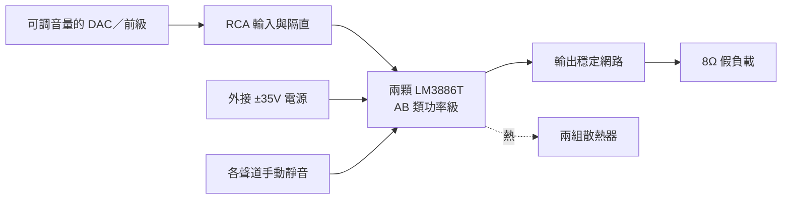

# LM3886 DIY AB 類立體聲後級

用兩顆 LM3886T 製作簡單的雙聲道後級，練習類比回授、接地、散熱與量測。第一階段目標 **2×40W／8Ω**，以 **2×50W／8Ω** 作為進階測試目標，暫定外接 **±35V DC**，RCA 輸入。

這是第三個獨立擴大機專案，可與 [TPA3255 練習機](https://github.com/ewinkuo1-sudo/diy-tpa3255-amplifier) 及 [Purifi 主力機](https://github.com/ewinkuo1-sudo/diy-purifi-amplifier) 比較架構與製作經驗。

## 目前進度：V0.1 電路草案

已有可編輯 KiCad 原理圖、PDF／PNG 預覽、43 個元件的 BOM、腳位／網路核對、功率與散熱計算，以及上電測試流程。KiCad 10.0.6 ERC 通過，0 錯誤、0 警告。

**尚無 PCB、完整電源／喇叭保護板、加工圖或實機量測。** 功率、失真、穩定度與散熱都還需原型驗證；目前輸出端供假負載測試。

## 電路圖


[下載 PDF](electrical/preview/lm3886-v01.pdf) · [KiCad 原理圖](electrical/lm3886-v01.kicad_sch) · [看圖與重建方式](electrical/README.md)



## 設計重點

| 項目 | V0.1 選擇 |
|---|---|
| 功率級 | LM3886T/NOPB ×2，非橋接、非並聯 |
| 輸出目標 | 先驗收 2×40W／8Ω，再測 50W／聲道餘裕 |
| 電源 | 外接追蹤式雙電源，標稱 ±35V；本版設計情境上限 ±37V |
| 增益 | IC 中頻閉迴路 21 倍；含輸入串阻後約 20.09 倍 |
| 輸入 | RCA，需上游音量控制；40W 約需 0.89Vrms 輸入，屬估算 |
| 靜音 | 各聲道 22k 電阻、100µF 電容及 RUN 跳線，拔除後進入靜音 |
| 散熱初選 | T 封裝，每聲道獨立 ≤0.5°C/W；介面 ≤0.5°C/W 為待核對條件 |
| 本版負載 | 8Ω 非感性假負載；4Ω 與真實喇叭需另外驗證 |

TI 列出 ±35V、8Ω 下 50W 的元件性能條件；這不是本機實測規格。[原廠資料](https://www.ti.com/product/LM3886)

## 文件

| 文件 | 內容 |
|---|---|
| [設計規格](docs/01-design.md) | 電路、接地、介面與保護邊界 |
| [功率與散熱估算](docs/02-calculations.md) | 可重算的數字、公式與假設 |
| [BOM 草案](electrical/bom-draft.csv) | 由 KiCad netlist 匯出，含選型條件 |
| [整機配件需求](docs/03-parts.md) | 電源、散熱、接頭、測試器材 |
| [上電與驗收](docs/04-bring-up.md) | 從低電壓到雙聲道功率測試 |
| [驗證紀錄](electrical/validation.md) | ERC、網路核對與未驗證事項 |
| [接班進度](HANDOFF.md) | 下一階段工作 |

## 重建與下一步

需要 Python 3、KiCad 10 CLI、Poppler 的 `pdftoppm`，Python 無第三方套件需求：

```sh
python3 tools/rebuild.py
```

下一版先定實際電源、LM3886T 封裝與散熱器，再畫單聲道 PCB；之後加入雙電源異常監測及喇叭 DC 保護／繼電器，完成假負載驗證後才進入聆聽測試。
