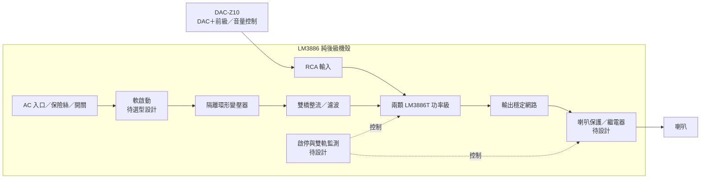

# LM3886 DIY AB 類立體聲後級

用兩顆 LM3886T 製作**內建電源的雙聲道純後級**，搭配使用者現有的 **Eversolo DAC-Z10（DAC＋前級）**。訊號路徑為 **DAC-Z10 RCA 前級輸出 → 本後級 → 喇叭**，音量與訊源選擇由 Z10 負責。本機採固定增益，前面板規劃電源及狀態指示。

第一階段目標 **2×40W／8Ω**，50W／聲道保留為延伸測試。內建線性電源暫以 **300VA、兩組獨立 25Vac 次級環形變壓器、雙橋整流、每軌 20,000µF** 規劃。負載下約 ±33V，會隨市電與負載變動；料件與功率尚未定案。輸入確定使用 RCA。

這是第三個獨立擴大機專案，可與 [TPA3255 練習機](https://github.com/ewinkuo1-sudo/diy-tpa3255-amplifier) 及 [Purifi 主力機](https://github.com/ewinkuo1-sudo/diy-purifi-amplifier) 比較架構與製作經驗。

## 目前進度：V0.2 內建電源規劃與次級電路草案

已有放大板與電源次級兩份可編輯 KiCad 原理圖、PDF／PNG 預覽、43＋15 個元件的分板 BOM、腳位／線束核對、功率／散熱／紋波估算及上電流程。兩份圖的 KiCad ERC 均通過，0 錯誤、0 警告。

**一次側接線、軟啟動及喇叭保護控制尚待設計；沒有 PCB、加工圖或實機量測。** 次級整流圖不是完整市電施工圖，功率與散熱仍需驗證；目前輸出端供假負載測試。

## 完整專案 PDF

[下載完整專案資料彙整（52 頁）](docs/LM3886_DIY_Project_Complete_2026-09-11.pdf)

2026-09-11 整理，資料快照為提交 0cf78b502b1b。含全部設計文件、58 個元件 BOM、兩張原始向量電路圖、七份程式全文、目錄與書籤；33 個原始檔以 PDF 附件保存。附件需使用支援附件面板的 PDF 閱讀器取用。這是文件彙編，未新增電路或硬體驗證。

## 電路圖


[下載 PDF](electrical/preview/lm3886-v01.pdf) · [KiCad 原理圖](electrical/lm3886-v01.kicad_sch) · [看圖與重建方式](electrical/README.md)


[電源 PDF](electrical/preview/internal-psu-v02.pdf) · [內建電源設計](docs/05-internal-power.md) · [電源 BOM](electrical/psu-bom-draft.csv)



## 設計重點

| 項目 | V0.2 選擇 |
|---|---|
| 功率級 | LM3886T/NOPB ×2，非橋接、非並聯 |
| 輸出目標 | 先驗收 2×40W／8Ω，再測 50W／聲道餘裕 |
| 電源 | 機內線性電源；300VA／2×25Vac 為候選，負載約 ±33V，±41V 作上界試算 |
| 增益 | IC 中頻閉迴路 21 倍；含輸入串阻後約 20.09 倍 |
| 輸入 | DAC-Z10 RCA 前級輸出；後級 40W 約需 0.89Vrms，音量由 Z10 控制 |
| 靜音 | 放大板保留測試跳線；整機需接入自動啟停／掉電控制，尚待設計 |
| 散熱初選 | T 封裝，每聲道 ≤0.4°C/W、介面 ≤0.3°C/W 為新估算條件，待選料核對 |
| 本版負載 | 8Ω 非感性假負載；4Ω 與真實喇叭需另外驗證 |

TI 列出 ±35V、8Ω 下 50W 的元件性能條件；這不是本機實測規格。[原廠資料](https://www.ti.com/product/LM3886)

## 文件

| 文件 | 內容 |
|---|---|
| [Z10 RCA 搭配](docs/07-z10-interface.md) | 已確認設備、電平與音量控制 |
| [設計規格](docs/01-design.md) | 電路、接地、介面與保護邊界 |
| [功率與散熱估算](docs/02-calculations.md) | 可重算的數字、公式與假設 |
| [內建電源與機構規劃](docs/05-internal-power.md) | 變壓器、整流、接地、控制及機殼分區 |
| [內建電源估算](docs/06-mains-calculations.md) | 市電變動、空載電壓、紋波、容量與放電 |
| [BOM 草案](electrical/bom-draft.csv) | 由 KiCad netlist 匯出，含選型條件 |
| [整機配件需求](docs/03-parts.md) | 電源、散熱、接頭、測試器材 |
| [上電與驗收](docs/04-bring-up.md) | 從低電壓到雙聲道功率測試 |
| [驗證紀錄](electrical/validation.md) | ERC、網路核對與未驗證事項 |
| [採購狀態](docs/08-procurement.md) | 已下單／到料料件與到料核對項目 |
| [接班進度](HANDOFF.md) | 下一階段工作 |

## 重建與下一步

需要 Python 3、KiCad 10 CLI、Poppler 的 `pdftoppm`，Python 無第三方套件需求：

```sh
python3 tools/rebuild.py
```

下一版確認一次側電壓、變壓器與散熱器料號，完成市電保護／軟啟動及喇叭 DC 保護控制，再定 PCB 與機殼尺寸。放大板單獨驗證時仍可用限流實驗電源；成機供電採內建方案。
