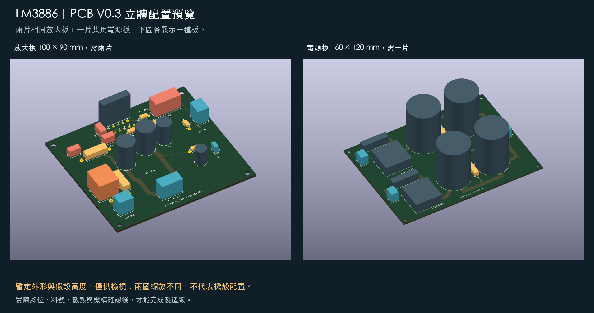
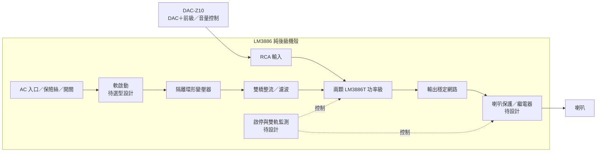

# LM3886 DIY AB 類立體聲後級

用兩顆 LM3886T 製作**內建電源的雙聲道純後級**，搭配使用者現有的 **Eversolo DAC-Z10（DAC＋前級）**。訊號路徑為 **DAC-Z10 RCA 前級輸出 → 本後級 → 喇叭**，音量與訊源選擇由 Z10 負責。本機採固定增益，前面板規劃電源及狀態指示。

已下單 **賣場標示 200W、兩組獨立 22Vac＋單 12Vac 的 AC110V 環形變壓器，以及 LM3886T 拆機 IC**，均待到貨。現改按約 ±30V 等級供電、每聲道約 30～40W／8Ω 探索規劃；VA、各繞組電流與實際功率尚未確認。詳見 [採購後修訂計畫](docs/09-採購後修訂計畫.md)。

這是第三個獨立擴大機專案，可與 [TPA3255 練習機](https://github.com/ewinkuo1-sudo/diy-tpa3255-amplifier) 及 [Purifi 主力機](https://github.com/ewinkuo1-sudo/diy-purifi-amplifier) 比較架構與製作經驗。

**已選 C 方案：完整雙聲道、雙橋整流、4×10,000µF／63V 主濾波電容（每軌 20,000µF）。只有變壓器與 IC 已下單；兩顆整流橋、四顆主電容和其他料件全部未購。** 喇叭保護、浪湧限制、散熱與機殼接地列入完整整機設計，細部料號尚待確認。

## 預計下單清單（2026-09-18）

[露天商品直達連結與其餘待買候選](docs/11-露天購物連結.md)：已核對原15項候選及23項新增商品，附數量、包裝選項與尚待確認的規格。

已登記 Vishay／RNU2 電阻、CDE／WIMA 電容，以及 ROE／Mundorf／NCC 替代候選。**本批尚未下單；47µF與470µF品牌仍未決定。** [查看數量、價格試算與封裝影響](docs/10-預計下單清單.md)。現有PCB與3D尚未按這批料件定版。

## 目前進度：2026-09-16 已下單，待到貨核對

兩份 KiCad 圖、PDF／PNG、BOM 與估算已更新為 V0.3 C 方案。保留雙橋四電容接法，改為 22Vac 供電標示；變壓器 VA／電流與控制電路仍待確認。

已有放大板與電源次級兩份可編輯 KiCad 原理圖、PDF／PNG 預覽、43＋15 個元件的分板 BOM、腳位／線束核對、功率／散熱／紋波估算及上電流程。兩份圖的 KiCad ERC 均通過，0 錯誤、0 警告。

**一次側接線、軟啟動及喇叭保護控制尚待設計；已有暫定 PCB 配置與部分走線，尚無可製造 PCB、加工圖或實機量測。** 次級整流圖不是完整市電施工圖，功率與散熱仍需驗證；目前輸出端供假負載測試。

## PCB B 方案修訂（V0.3／2026-09-17）

已訂 **LM3886T 與變壓器仍在寄送中**。本輪改善 C3/C4 的局部回地、分開輸出與回授取樣、加寬主電流路徑，並依 40W／8Ω 情境完成銅箔電阻、壓降與發熱功率估算。計算情境不是本機額定或量測。

仍採兩片 **100 × 90 mm 單聲道板**＋一片 **160 × 120 mm 共用電源板**。KiCad 10.0.6、固定 0.3 mm 間距規則下，兩板均 **0 DRC 違規、0 未連通**，54＋35 焊盤網路對照通過。封裝、實際溫升、散熱與機構仍待確認，**不可直接製造**。


[新版 PCB 與驗證](pcb/README-v03.md)／[本輪審查](pcb/review-v03.md)／[計算表](pcb/current-budget-v03.md)。V0.1／V0.2 板檔保留並已歸檔至 `pcb/archive/`；V0.2 規則文字有更正，本輪已修復重建還原設定的問題。原理圖和既有 V0.3 PDF 未修改，PDF 未收錄本版 PCB。

## PCB 看圖與選料資料（2026-09-18）

已完成正反面銅箔圖、極性／組裝圖、兩板三種角度的 3D 預覽、可旋轉的 KiCad 預覽板，以及 37 項零件／封裝核對表。**元件模型採暫定外框與假設高度，尚非可製造裝配模型。** 原理圖與 PCB V0.3 走線保持不變。

[正反面、組裝與 3D 圖索引](pcb/inspection-v03/README.md) · [零件與封裝核對表](pcb/inspection-v03/parts-audit.md)



## 最新 PDF（V0.3／2026-09-16）

- [C 方案設計與電路彙整](output/pdf/LM3886_Plan_C_V03.pdf)：現行設計、整機方塊圖、估算、採購與兩張向量電路圖。
- [C 方案採購勾選清單](output/pdf/LM3886_Shopping_V03.pdf)：僅變壓器及 IC 已訂，其餘待購。
- [2026-09-11 舊完整 PDF](docs/archive/LM3886_DIY_Project_Complete_2026-09-11.pdf)：歷史快照，舊供電與採購資訊不再適用。

## 電路圖

**2026-09-17：六張中文導讀圖已同步方案 C V0.3。** 更新雙 22Vac／雙橋四電容、回授串聯關係、元件編號與靜音極性，補上 PCB V0.3 回流說明。[導讀圖索引與重建方式](docs/diagrams/README.md)。


[下載 PDF](electrical/preview/lm3886-v01.pdf) · [KiCad 原理圖](electrical/lm3886-v01.kicad_sch) · [看圖與重建方式](electrical/README.md)


[電源 PDF](electrical/preview/internal-psu-v02.pdf) · [內建電源設計](docs/05-內建電源與機構.md) · [電源 BOM](electrical/psu-bom-draft.csv)



## 設計重點

| 項目 | 目前選擇／待驗證 |
|---|---|
| 功率級 | LM3886T ×2，非橋接、非並聯；已訂拆機品，/NOPB 未確認 |
| 輸出目標 | 每聲道約 30～40W／8Ω 探索範圍，額定待實測 |
| 電源 | 已訂雙 22Vac＋單 12Vac；雙橋架構保留，約 ±30V 等級；VA／電流／最大電壓待確認 |
| 增益 | IC 中頻閉迴路 21 倍；含輸入串阻後約 20.09 倍 |
| 輸入 | DAC-Z10 RCA 前級輸出；後級 40W 約需 0.89Vrms，音量由 Z10 控制 |
| 靜音 | 放大板保留測試跳線；整機需接入自動啟停／掉電控制，尚待設計 |
| 散熱初選 | T 封裝，每聲道 ≤0.4°C/W、介面 ≤0.3°C/W 為新估算條件，待選料核對 |
| 本版負載 | 8Ω 非感性假負載；4Ω 與真實喇叭需另外驗證 |

TI 列出 ±35V、8Ω 下 50W 的元件性能條件；這不是本機實測規格。[原廠資料](https://www.ti.com/product/LM3886)

## 文件

[目前適用：V0.3 C 方案](docs/09-採購後修訂計畫.md)；文件已同步目前供電假設；未選料與未量測項目有明確標註。

**要買零件看這一份：[採購總表](docs/00-採購總表.md)** — 已下單／可下單／要先確認／暫緩四段分類，附購買順序與所有商品連結。下面 03、08、09、10、11、12 六份為其附錄。

| 文件 | 內容 |
|---|---|
| [採購總表](docs/00-採購總表.md) | **採購單一入口**：狀態分類、購買順序、全部商品連結與金額試算 |
| [Z10 RCA 搭配](docs/07-Z10介面.md) | 已確認設備、電平與音量控制 |
| [設計規格](docs/01-設計規格.md) | 電路、接地、介面與保護邊界 |
| [功率與散熱估算](docs/02-功率與散熱估算.md) | 可重算的數字、公式與假設 |
| [內建電源與機構規劃](docs/05-內建電源與機構.md) | 變壓器、整流、接地、控制及機殼分區 |
| [內建電源估算](docs/06-市電與電源估算.md) | 市電變動、空載電壓、紋波、容量與放電 |
| [BOM 草案](electrical/bom-draft.csv) | 由 KiCad netlist 匯出，含選型條件 |
| [整機配件需求](docs/03-整機配件需求.md) | 電源、散熱、接頭、測試器材 |
| [上電與驗收](docs/04-上電與驗收.md) | 從低電壓到雙聲道功率測試 |
| [驗證紀錄](electrical/validation.md) | ERC、網路核對與未驗證事項 |
| [採購狀態](docs/08-採購狀態.md) | 已下單／到料料件與到料核對項目 |
| [機殼候選](docs/12-機殼候選.md) | 淘寶候選、需求推導與下單前確認項目（未下單） |
| [接班進度](HANDOFF.md) | 下一階段工作 |

## 重建與下一步

需要 Python 3、KiCad 10 CLI、Poppler 的 `pdftoppm`，Python 無第三方套件需求：

```sh
python3 tools/rebuild.py
```

下一版確認一次側電壓、變壓器與散熱器料號，完成市電保護／軟啟動及喇叭 DC 保護控制，再修訂 PCB 草稿與機殼尺寸。放大板單獨驗證時仍可用限流實驗電源；成機供電採內建方案。

PDF 重製：先執行 `python3 tools/rebuild.py`，再以安裝 reportlab／pypdf 的 Python 執行 `tools/build_project_pdf.py`；非 Windows 環境需設定 `LM3886_FONT` 指向 CJK TrueType 字型。
