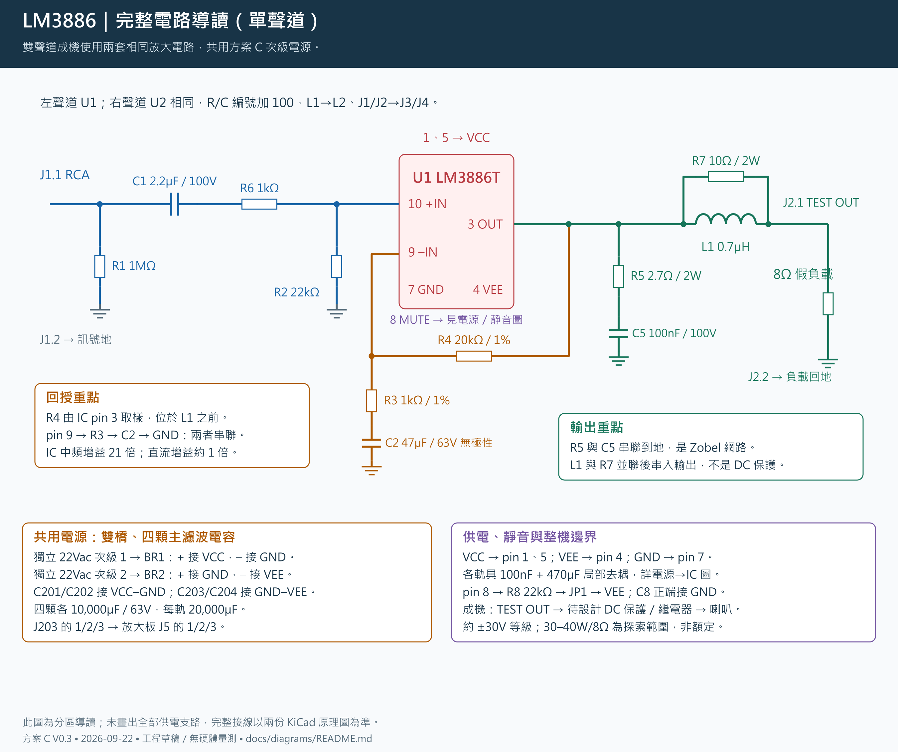
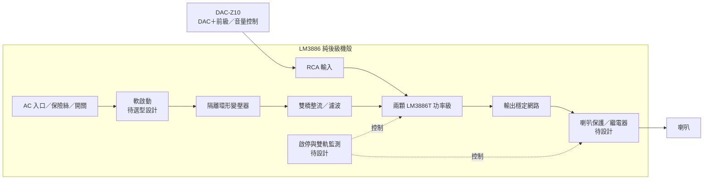
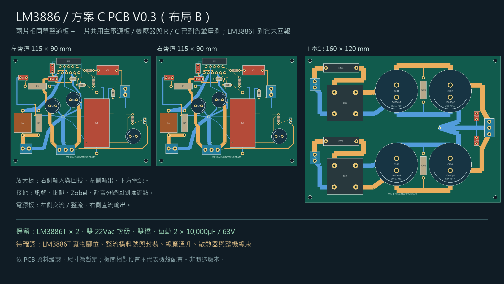

# LM3886 DIY AB 類立體聲後級

用兩顆 LM3886T 製作**內建電源的雙聲道純後級**，搭配使用者現有的 **Eversolo DAC-Z10（DAC＋前級）**。訊號路徑為 **DAC-Z10 RCA 前級輸出 → 本後級 → 喇叭**，音量與訊源選擇由 Z10 負責。本機採固定增益，前面板規劃電源及狀態指示。

這是第三個獨立擴大機專案，可與 [TPA3255 練習機](https://github.com/ewinkuo1-sudo/diy-tpa3255-amplifier) 及 [Purifi 主力機](https://github.com/ewinkuo1-sudo/diy-purifi-amplifier) 比較架構與製作經驗。



## 目前狀態（2026-09-22）

- **已選 C 方案**：完整雙聲道、雙橋整流、4×10,000µF／63V 主濾波電容（每軌 20,000µF），約 ±30V 等級供電，每聲道約 30～40W／8Ω 為探索範圍而非額定。
- **2026-09-16／17 已下單**：賣場標示 200W、兩組獨立 22Vac＋單 12Vac 的 AC110V 環形變壓器，以及 LM3886T 拆機 IC，均待到貨；VA 與各繞組電流未確認。
- **2026-09-20 已下單**：全部電阻、WIMA、CDE 主電容／靜音電容與 ROE 電解（露天 yosontw，40 件 $2,298 含運）。
- **電容選型定案**：47µF＝ROE EGW（臥式無極性）、470µF＝ROE EKE／63V。
- **PCB V0.3 是工程草稿，不可送製**：兩板 KiCad DRC 0 違規、0 未連通，但封裝、溫升、散熱與機構皆未驗證。
- **到貨後第一件事**：量測四款電解（ROE EGW 47µF、ROE EKE 470µF、CDE 381LX、CDE 361R）的實體尺寸，再改封裝、重建 PCB。CDE 型錄已先確定兩件事：C8 的 361R 是 Ø12.5／腳距 5 mm，現板 Ø8／3.5 mm 封裝**必改**；381LX 的 A052 料號不在現行型錄（63V／10,000µF 只有 Ø30 的 K 殼），到貨先對印字。
- **生成器已改、產物待重建**：原理圖生成器的 C1／C3／C4／C8 耐壓改成實購 100V、R8 改 0.6W、title block 與電源圖註記已更新，但 `.kicad_sch`／PDF／BOM／PCB 尚未重建（本機無 KiCad），等封裝改完一起做。導讀圖與 PCB 預覽圖已依現況重繪。
- **仍未購**：整流橋、保險絲座／保險絲、電感、接頭、端子、絕緣與散熱件、AC 入口、軟啟動、喇叭保護板、線材、假負載、機殼。
- **V0.4 進入設計草案**：控制板（軟啟動旁通、喇叭 DC 保護、靜音接管、Z10 trigger、12Vac 輔助電源）的架構、時序、介面與計算見 [14 設計草案](docs/14-V0.4-控制與保護板設計草案.md)；原理圖、PCB、BOM 尚無，繼電器與軟啟動元件等變壓器到貨量完才選。

**要買零件看 [採購總表](docs/00-採購總表.md)**（已買／未買兩張表＋購買順序）。**要接手看 [HANDOFF.md](HANDOFF.md)**。**歷史逐日紀錄看 [CHANGELOG.md](CHANGELOG.md)**。

## 系統方塊



## 設計重點

| 項目 | 目前選擇／待驗證 |
|---|---|
| 功率級 | LM3886T ×2，非橋接、非並聯；已訂拆機品，/NOPB 未確認 |
| 輸出目標 | 每聲道約 30～40W／8Ω 探索範圍，額定待實測 |
| 電源 | 已訂雙 22Vac＋單 12Vac；雙橋架構保留，約 ±30V 等級；VA／電流／最大電壓待確認 |
| 增益 | IC 中頻閉迴路 21 倍；含輸入串阻後約 20.09 倍 |
| 輸入 | DAC-Z10 RCA 前級輸出；後級 40W 約需 0.89Vrms，音量由 Z10 控制 |
| 靜音 | 放大板保留測試跳線；整機需接入自動啟停／掉電控制，尚待設計 |
| 散熱初選 | T 封裝，每聲道 ≤0.4°C/W、介面 ≤0.3°C/W 為新估算條件，待選料核對 |
| 本版負載 | 8Ω 非感性假負載；4Ω 與真實喇叭需另外驗證 |

TI 列出 ±35V、8Ω 下 50W 的元件性能條件；這不是本機實測規格。[原廠資料](https://www.ti.com/product/LM3886)

## 文件

| 文件 | 內容 |
|---|---|
| [採購總表](docs/00-採購總表.md) | **採購單一入口**：已買／未買、購買順序、商品連結 |
| [設計規格](docs/01-設計規格.md) | 電路、接地、Z10 介面與保護邊界 |
| [功率與散熱估算](docs/02-功率與散熱估算.md) | 可重算的數字、公式與假設 |
| [上電與驗收](docs/04-上電與驗收.md) | 從低電壓到雙聲道功率測試 |
| [內建電源與機構](docs/05-內建電源與機構.md) | 變壓器、整流、接地、機殼分區與電源估算 |
| [喇叭保護與啟停設計計畫](docs/13-喇叭保護與啟停設計計畫.md) | V0.4 需求：保護、延遲、DC 偵測與啟停方案 |
| [V0.4 控制與保護板設計草案](docs/14-V0.4-控制與保護板設計草案.md) | 控制板架構、啟停時序、與現有板介面、繼電器篩選、軟啟動與輔助電源計算 |
| [導讀圖索引](docs/diagrams/README.md) | 六張中文電路導讀圖與重建方式 |
| [BOM 草案](electrical/bom-draft.csv) | 由 KiCad netlist 匯出，含選型條件 |
| [驗證紀錄](electrical/validation.md) | ERC、網路核對與未驗證事項 |
| [原理圖說明](electrical/README.md) | 放大板與電源次級 KiCad 圖、看圖與重建方式 |
| [PCB V0.3](pcb/README.md) | 板檔、DRC、審查結論與載流計算表 |
| [PCB 看圖資料](pcb/inspection-v03/README.md) | 正反面銅箔、組裝、3D 預覽與零件核對表 |
| [工具說明](tools/README.md) | 各腳本用途與執行順序 |
| [接班進度](HANDOFF.md) | 現況與下一階段工作 |
| [變更紀錄](CHANGELOG.md) | 逐日進度歷史 |

## 電路圖與 PCB 預覽


[放大板 PDF](electrical/preview/lm3886-v01.pdf) · [KiCad 原理圖](electrical/lm3886-v01.kicad_sch)


[電源 PDF](electrical/preview/internal-psu-v02.pdf) · [電源 BOM](electrical/psu-bom-draft.csv)



## 重建與下一步

需要 Python 3、KiCad 10 CLI、Poppler 的 `pdftoppm`，Python 無第三方套件需求：

```sh
python3 tools/rebuild.py
```

下一版確認一次側電壓、變壓器與散熱器料號，完成市電保護／軟啟動及喇叭 DC 保護控制，再修訂 PCB 草稿與機殼尺寸。放大板單獨驗證時仍可用限流實驗電源；成機供電採內建方案。

PDF 重製：先執行 `python3 tools/rebuild.py`，再以安裝 reportlab／pypdf 的 Python 執行 `tools/build_project_pdf.py`；非 Windows 環境需設定 `LM3886_FONT` 指向 CJK TrueType 字型。產物在 `output/`，不入版控。
