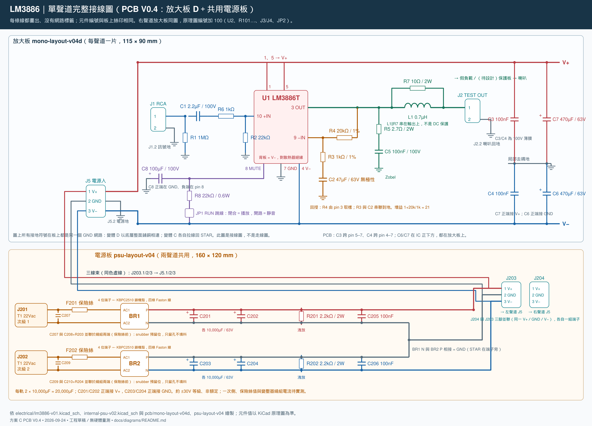
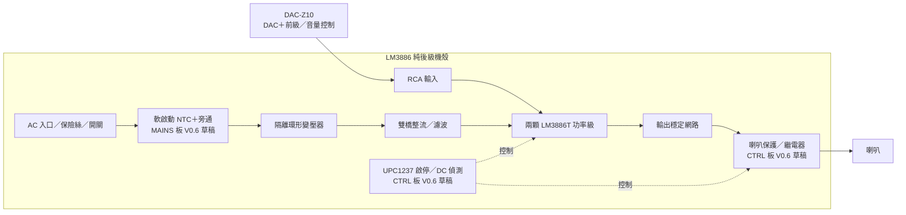
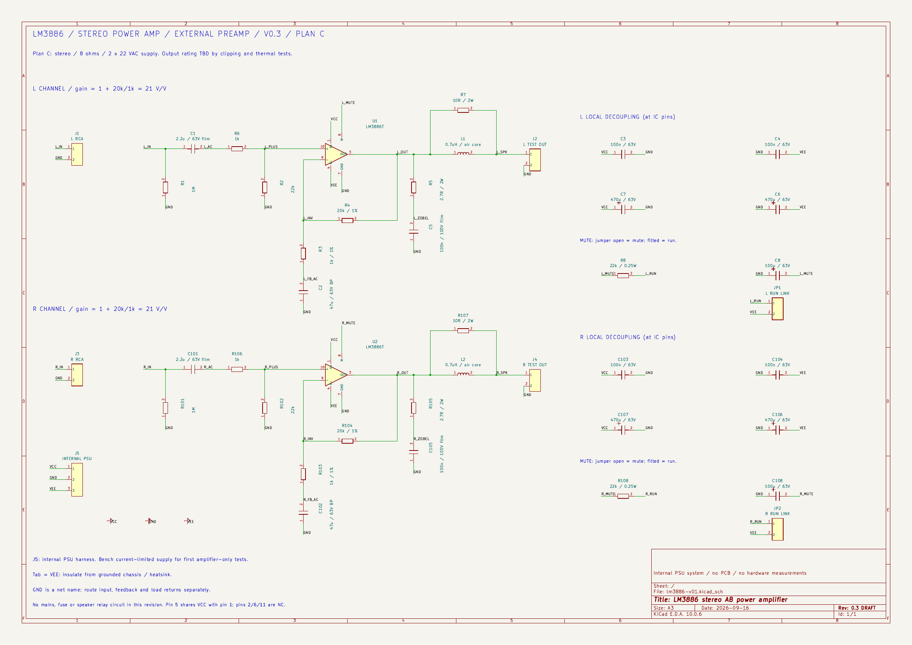
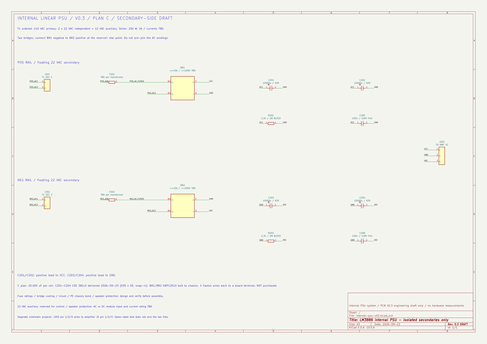
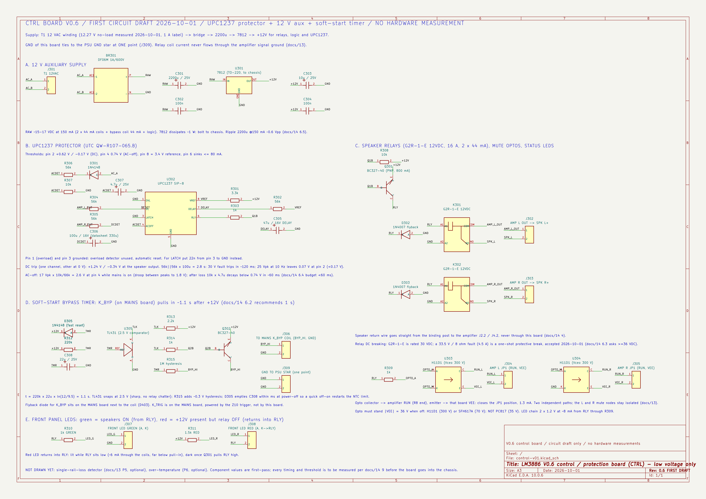
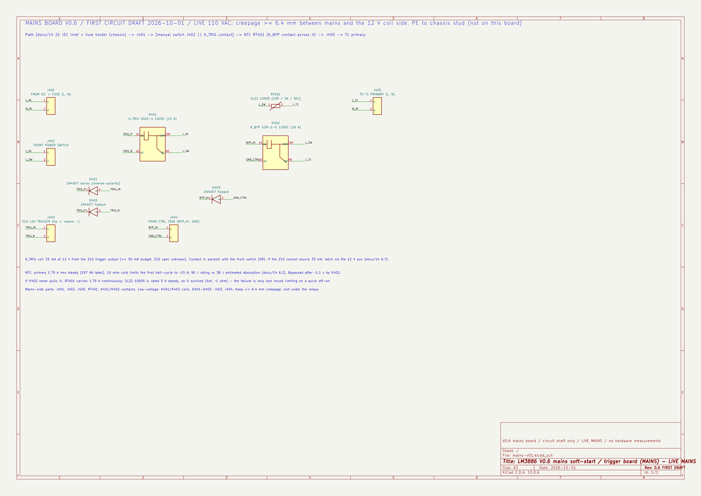
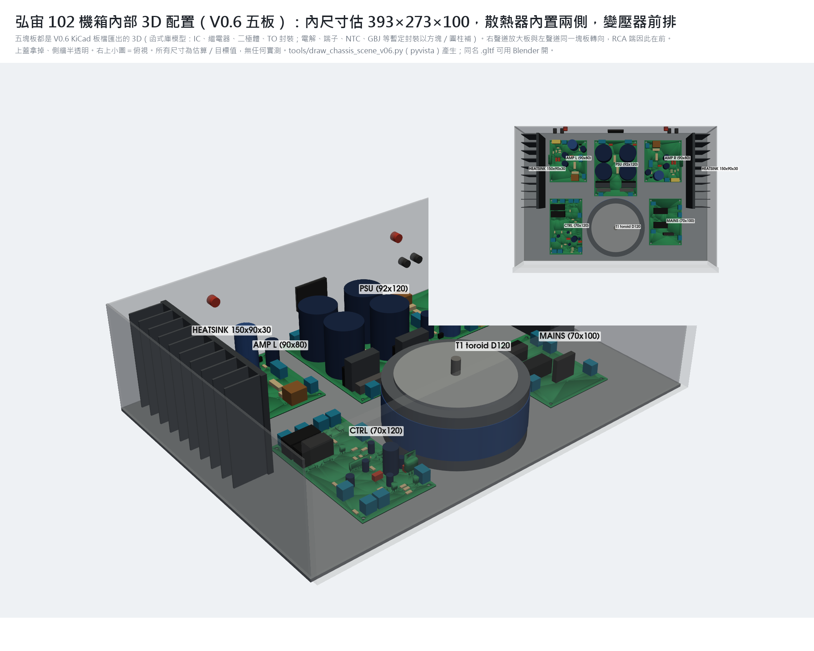
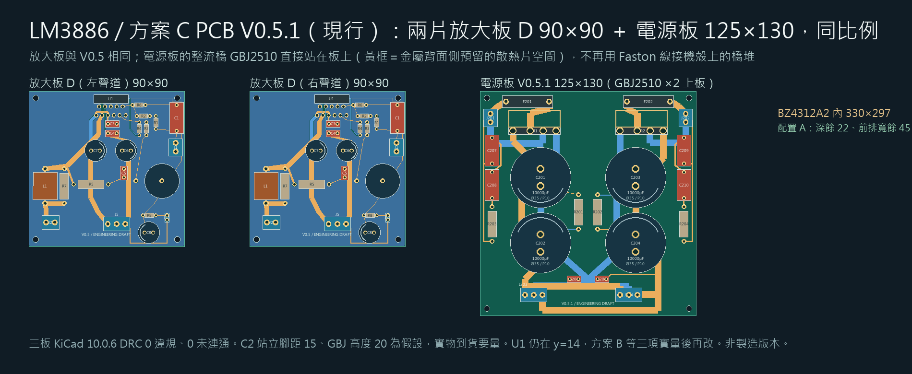

# LM3886 DIY AB 類立體聲後級

用兩顆 LM3886T 製作**內建電源的雙聲道純後級**，搭配使用者現有的 **Eversolo DAC-Z10（DAC＋前級）**。訊號路徑為 **DAC-Z10 RCA 前級輸出 → 本後級 → 喇叭**，音量與訊源選擇由 Z10 負責。本機採固定增益，前面板規劃電源及狀態指示。

這是第三個獨立擴大機專案，可與 [TPA3255 練習機](https://github.com/ewinkuo1-sudo/diy-tpa3255-amplifier) 及 [Purifi 主力機](https://github.com/ewinkuo1-sudo/diy-purifi-amplifier) 比較架構與製作經驗。



## 目前狀態（2026-10-01 深夜）

- **方向改為「先挑殼、散熱器放殼內、以現有零件重排 PCB＝V0.6」**。機殼改選台灣現貨 **弘宙 102**（型錄 b420 前面板寬、d395 機身寬、c285 深不含把手、e105 高 → 內尺寸估 **393×273×100**，賣家未確認；BZ4312A2 留給下一台）。配置：後排「放大板 L｜電源板｜放大板 R」、前排變壓器居中、左前控制板、右前市電板；散熱器 **150×90×30 鋁擠 ×2 內置兩側**（鰭片朝牆、底板朝板、上蓋底板開通風孔；規格依 8 Ω 連續正弦 θSA ≤1.2 °C/W）。3D 配置：[chassis_102_v06_3d.png](docs/diagrams/chassis_102_v06_3d.png)。下單前問賣家內寬、通風孔、後面板是否空白。
- **控制／保護板 CTRL 與市電板 MAINS 第一版原理圖＋PCB V0.6 已畫**（2026-10-01 深夜）：CTRL 70×120（UPC1237 保護、7812 輔助電源、G2RL-1-E 喇叭繼電器 ×2、SFH617A 光耦靜音、TL431 旁通計時）、MAINS 70×100（SL22 10005 NTC、K_BYP、K_TRIG）。ERC 0、DRC 0 錯誤，市電／低壓銅箔距離 7.25 mm。繼電器 DC 分斷取 30 VDC 等級（使用者接受）。見 [docs/14](docs/14-V0.4-控制與保護板設計草案.md) 狀態列、[pcb/README「PCB V0.6」](pcb/README.md)。
- **放大板與電源板現行仍是 V0.5.1**（放大板 D 90×90＋電源板 125×130，GBJ2510 直立上板，DRC 0）；**V0.6 版（放大板 80×90 IC 貼板邊、電源板 87×120）尚未畫**，等 LM3886T 三個實量尺寸與機殼內寬。詳見 [pcb/README](pcb/README.md)、[inspection-v051](pcb/inspection-v051/README.md)；V0.5／V0.4／V0.3 為歷史。**全部仍是工程草稿，不可送製。**
- **目標喇叭 Usher Be-718**（標稱 8 Ω、實測低中音 >6 Ω、約 85 dB）：匹配估算見 [docs/01](docs/01-設計規格.md)；功率／散熱討論以 6–8 Ω 為準。
- **已到貨**：環形變壓器、yosontw 40 件電阻／WIMA／CDE／ROE（2026-09-22）、LM3886T 拆機品 ×4（2026-09-29，T 封裝、NS 打標）。已付 NT$4,821，整機估 10.9k–16.2k（[採購總表 §5](docs/00-採購總表.md)）。
- **2026-10-01 已量變壓器電氣**（採購總表 §1）：標籤 22V 4.2A×2＋12V 1A ≈ **197 VA**；兩組 22V 空載各 22.29 Vac（DCR 0.25／0.2 Ω）、串接 44.6 Vac 同相；12V 12.27 Vac；一次側約 2 Ω；市電 110 V。最壞軌電壓 **±33.5 V**，帶載推估連續 30–32 W／8 Ω。保險絲提案：一次側 T2.5A（有軟啟動）／T3.15A、22V 各 T5A、12V T1.25A。**未量：帶載電壓、絕緣、溫升。**
- **已量零件尺寸**（2026-09-23）：381LX Ø35×50 腳距 10；EKE Ø12×25 腳距 5；EGW 軸向 40×Ø20（V0.5 起改站立封裝，**腳距 15 是假設待實量**）；變壓器 Ø120×約 50、中心孔 Ø40。
- **選型定案**：C 方案雙聲道、雙橋整流、4×10,000µF／63V；47µF＝ROE EGW 無極性、470µF＝ROE EKE／63V；每聲道 30～40W／8Ω 為探索範圍而非額定。
- **本輪可買**：GBJ2510 ×2＋小散熱片＋M3 件、保險絲、機殼（弘宙 102）、散熱器 150×90×30 ×2、控制板零件一套（G2RL-1-E 12VDC ×5、UPC1237 ×2、SL22 10005、SFH617A-3 ×2、TL431、BC327 ×2、7812 等，見採購總表控制板列）；其餘未購件與順序見採購總表 §2／§3。

**要買零件看 [採購總表](docs/00-採購總表.md)**（已買／未買兩張表＋購買順序）。**要接手看 [HANDOFF.md](HANDOFF.md)**。**歷史逐日紀錄看 [CHANGELOG.md](CHANGELOG.md)**。

## 系統方塊


```mermaid
flowchart LR
    PRE[DAC-Z10\nDAC＋前級／音量控制]
    subgraph AMP[LM3886 純後級機殼]
        IN[RCA 輸入] --> C[兩顆 LM3886T 功率級]
        C --> D[輸出穩定網路]
        D --> REL[喇叭保護／繼電器\nCTRL 板 V0.6 草稿]
        AC[AC 入口／保險絲／開關] --> SS[軟啟動 NTC＋旁通\nMAINS 板 V0.6 草稿]
        SS --> T[隔離環形變壓器]
        T --> PSU[雙橋整流／濾波]
        PSU --> C
        CTRL[UPC1237 啟停／DC 偵測\nCTRL 板 V0.6 草稿] -. 控制 .-> C
        CTRL -. 控制 .-> REL
    end
    PRE --> IN
    REL --> SPK[喇叭]
```

## 設計重點

| 項目 | 目前選擇／待驗證 |
|---|---|
| 功率級 | LM3886T ×2，非橋接、非並聯；已訂拆機品，/NOPB 未確認 |
| 輸出目標 | 每聲道約 30～40W／8Ω 探索範圍，額定待實測 |
| 電源 | 已訂雙 22Vac＋單 12Vac；雙橋架構保留，約 ±30V 等級；VA／電流／最大電壓待確認 |
| 增益 | IC 中頻閉迴路 21 倍；含輸入串阻後約 20.09 倍 |
| 輸入 | DAC-Z10 RCA 前級輸出；後級 40W 約需 0.89Vrms，音量由 Z10 控制 |
| 靜音／保護 | 放大板保留測試跳線；CTRL 板 V0.6 草稿以 UPC1237 做 DC 偵測、開機延遲、掉電快斷，光耦接管 JP1 靜音，解除靜音＝喇叭繼電器吸合 |
| 散熱 | T 封裝，**2026-10-01 改以 8 Ω 連續正弦為準：每聲道散熱器 ≤1.2 °C/W**（6 Ω 正弦需 ≤0.65）、介面 ≤0.3 °C/W；選 150×90×30 鋁擠內置兩側，估法 θSA≈1000／表面積(cm²)；原 0.4 °C/W 是 ±41 V 前提的保守值 |
| 本版負載 | 8Ω 非感性假負載；目標喇叭 Usher Be-718（標稱 8Ω、低中音實測 >6Ω、靈敏度實測約 85dB），匹配估算見 [01](docs/01-設計規格.md)「目標喇叭」節；真實喇叭需另外驗證 |

TI 列出 ±35V、8Ω 下 50W 的元件性能條件；這不是本機實測規格。[原廠資料](https://www.ti.com/product/LM3886)

## 文件

| 文件 | 內容 |
|---|---|
| [採購總表](docs/00-採購總表.md) | **採購單一入口**：已買／未買、購買順序、商品連結 |
| [設計規格](docs/01-設計規格.md) | 電路、接地、Z10 介面與保護邊界 |
| [功率與散熱估算](docs/02-功率與散熱估算.md) | 可重算的數字、公式與假設 |
| [上電與驗收](docs/04-上電與驗收.md) | 從低電壓到雙聲道功率測試 |
| [內建電源與機構](docs/05-內建電源與機構.md) | 變壓器、整流、接地、機殼分區與電源估算 |
| [喇叭保護與啟停設計計畫](docs/13-喇叭保護與啟停設計計畫.md) | V0.4 需求：保護、延遲、DC 偵測與啟停方案 |
| [V0.4 控制與保護板設計草案](docs/14-V0.4-控制與保護板設計草案.md) | 控制板架構、啟停時序、與現有板介面、繼電器篩選、軟啟動與輔助電源計算；開頭狀態列記 2026-10-01 的選型決定與原理圖／PCB V0.6 偏離之處 |
| [控制板原理圖 CTRL](electrical/preview/control-v01.png)／[市電板 MAINS](electrical/preview/mains-v01.png) | 2026-10-01 第一版（生成器 `tools/build_control_board.py`，ERC 0）；[CTRL PDF](electrical/preview/control-v01.pdf)、[MAINS PDF](electrical/preview/mains-v01.pdf) |
| [導讀圖索引](docs/diagrams/README.md) | 單聲道完整接線圖（放大板＋電源板全部畫出）與五張中文導讀圖 |
| [BOM 草案](electrical/bom-draft.csv) | 由 KiCad netlist 匯出，含選型條件 |
| [驗證紀錄](electrical/validation.md) | ERC、網路核對與未驗證事項 |
| [原理圖說明](electrical/README.md) | 放大板與電源次級 KiCad 圖、看圖與重建方式 |
| [PCB](pcb/README.md) | **V0.6 新板 CTRL 70×120＋MAINS 70×100（DRC 0）**；放大板／電源板現行 V0.5.1（放大板 D 90×90、電源板 125×130 整流橋上板）；V0.5／V0.4／V0.3 歷史：板檔、DRC、審查結論與載流計算表 |
| [機箱 3D 配置](docs/diagrams/chassis_102_v06_3d.png) | 弘宙 102 內部等角＋俯視（`tools/draw_chassis_scene_v06.py`，pyvista；CTRL／MAINS 為真板 3D，放大板與電源板為 V0.6 目標外形示意） |
| [PCB 看圖資料](pcb/inspection-v051/README.md) | V0.5.1（放大板 D＋電源板）正反面銅箔、組裝、3D 預覽與零件核對表；[V0.5](pcb/inspection-v05/README.md)／[V0.4](pcb/inspection-v04/README.md)／[V0.3](pcb/inspection-v03/README.md) 版保留 |
| [工具說明](tools/README.md) | 各腳本用途與執行順序 |
| [接班進度](HANDOFF.md) | 現況與下一階段工作 |
| [變更紀錄](CHANGELOG.md) | 逐日進度歷史 |

## 電路圖與 PCB 預覽



[放大板 PDF](electrical/preview/lm3886-v01.pdf) · [KiCad 原理圖](electrical/lm3886-v01.kicad_sch)



[電源 PDF](electrical/preview/internal-psu-v02.pdf) · [電源 BOM](electrical/psu-bom-draft.csv)










## 重建與下一步

需要 Python 3、KiCad 10 CLI、Poppler 的 `pdftoppm`，Python 無第三方套件需求：

```sh
python3 tools/rebuild.py
```

`rebuild.py` 目前只重建放大板與電源次級原理圖；控制板與市電板（`tools/build_control_board.py`）和所有 PCB 腳本要手動跑，順序見 [tools/README](tools/README.md)。

下一步（詳見 [HANDOFF](HANDOFF.md)）：量 LM3886T 三個尺寸、問賣家弘宙 102 內寬 → 畫放大板／電源板 V0.6；審控制板原理圖與 PCB、買控制板零件並核對繼電器腳位；麵包板實測 UPC1237 在 12 V 供電下的門檻與延遲；變壓器帶載量測。放大板單獨驗證時仍可用限流實驗電源；成機供電採內建方案。

PDF 重製：先執行 `python3 tools/rebuild.py`，再以安裝 reportlab／pypdf 的 Python 執行 `tools/build_project_pdf.py`；非 Windows 環境需設定 `LM3886_FONT` 指向 CJK TrueType 字型。產物在 `output/`，不入版控。
