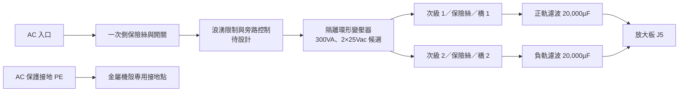

# V0.2 內建電源與純後級規劃

## 已確認的使用方式

使用者要內建供電的後級，已確認搭配 Eversolo DAC-Z10，以它的 RCA 前級輸出連接。音訊一路為 `DAC-Z10（DAC＋前級）→ RCA → LM3886 → 喇叭`，音量由 Z10 負責；本機固定增益，配置 AC 入口、電源開關、狀態指示、左右聲道輸入及喇叭輸出。

已選定 RCA，後級中頻增益約 20.09 倍，40W 所需輸入約 0.89Vrms。Z10 原廠 RCA 輸出規格為 2.5Vrms／0dBFS，應使用其音量控制；詳見[Z10 搭配與電平說明](07-z10-interface.md)。

## 內建電源架構

環形變壓器、整流濾波與放大板都放進後級機殼。候選一次側按 110V／60Hz 規劃，次級要兩組真正獨立的 25Vac 繞組，每組各一個全橋，再把橋 1 的負端與橋 2 的正端相連形成 GND。這個雙橋版本**不能使用已在變壓器內部相接的三線中心抽頭次級**。

次級原理圖為 [internal-psu-v02.kicad_sch](../electrical/internal-psu-v02.kicad_sch)。BR1／BR2 使用功能端子 AC1、AC2、P、N，實體腳位須在確定整流橋料號後依 datasheet 對應。F201／F202 只畫出次級保險絲位置，額定電流及分斷能力未定案。

每軌兩顆 10,000µF／63V 並聯、100nF 薄膜旁路、一顆 2.2k／2W 洩放電阻。濾波值與變壓器 300VA 都是設計候選，未核對尺寸、紋波額定或庫存。未穩壓電壓會隨市電與負載變動，不能稱為固定 ±35V 穩壓電源。[TI AN-1849](https://www.ti.com/lit/an/snaa057c/snaa057c.pdf)提供相關架構及高市電、浪湧與啟停設計參考，本機參數另行估算。

## 電壓與散熱變更

採兩顆二極體合計 2.2V 壓降、每軌 20,000µF 的簡化模型，標稱市電、雙聲道 40W 時每軌平均約 33V。低市電時不保證達到 40W，50W 是待量測的延伸目標。詳見[電源估算](06-mains-calculations.md)。

在 +10% 市電與假設 +8% 空載調整率下，可接近 ±40.8V，因此舊版 ±37V 熱預算已不足。本版用 ±41V 上界重算，初選每顆 IC 介面 ≤0.3°C/W、獨立散熱器 ≤0.4°C/W；兩者必須以實際元件核對。這個上界是評估情境，尚無過壓箝位；變壓器誤差、實際一次側額定及啟停峰值若超出，須重選次級電壓或修改方案。

## 一次側、控制與接地待完成項

| 區塊 | 本版範圍 | 定案條件 |
|---|---|---|
| AC 入口／一次側保險絲／電源開關 | 機構及功能規劃 | 核對一次側型號、額定電流、分斷能力、隔離及接線端子的防觸碰 |
| 浪湧限制／旁路 | 預留設計 | 驗證冷開機、快速關開、旁路失敗與放電時間，不只看穩態瓦數 |
| 變壓器 | 300VA、2×25Vac 候選 | 確認一次側電壓、空載調整率、絕緣、溫升、引線及熱保護 |
| 喇叭保護／控制電源 | 功能與空間預留 | 設計獨立小容量隔離輔助電源或適當輔助繞組，確保失電時先斷開喇叭 |
| 自動靜音 | 取代成機手動 RUN 操作 | 兩軌正常才允許啟動；掉電、DC 故障、過溫時靜音並斷開輸出 |
| 喇叭 DC 保護／繼電器 | 尚未畫入電路 | 正負 DC 故障偵測及繼電器實際 DC 斷開能力測試 |
| 保護接地 PE | 機殼直接接地為設計要求 | 獨立牢靠接點；不經開關、保險絲或音訊地阻抗元件 |
| 訊號地／機殼關係 | 暫定單一連接位置 | 按前級介面與整機接地檢查嗡聲；不能以斷開 PE 解決地迴路 |

這份文件與次級原理圖不是完整市電施工圖。一次側料件、接線與機構隔離完成後，要另行核對保護接地連續性、絕緣及啟停故障；放大板 ERC 不涵蓋這些項目。

## 機殼配置

以金屬機殼為主，先保留以下分區，尺寸待真實零件再定：

- 後板：AC 入口與音訊輸入分開配置，左右聲道各一組輸入、一組喇叭端子。
- 電源區：變壓器、一次側保護及浪湧控制集中，市電區加固定及防觸碰安排。
- 整流區：整流橋與大電容靠近，縮小充電迴路，橋另核對散熱。
- 放大區：兩聲道靠近各自散熱器，前級輸入線短且遠離變壓器與充電電流迴路。
- 控制區：預留輔助電源、DC 保護及繼電器空間。

環形變壓器固定螺栓不可與機殼形成穿過中心的封閉導電匝；具體固定方式依原廠安裝圖。[Talema 安裝提醒](https://talema.com/products/toroidal-transformers-open-style/)

## 線束與調試

電源圖 J203 的 1／2／3 對接放大板 J5 的 1／2／3，即 VCC／GND／VEE。兩份 KiCad 圖是獨立分板專案，網名相同不會自動跨檔連線；驗證腳本另檢查接序。

第一輪放大板測試仍以可限流實驗電源進行；內建供電先獨立驗證空載、負載及放電，再接入放大板。本版整機目標始終是內建供電，不要求使用者日常外接 DC 電源。
