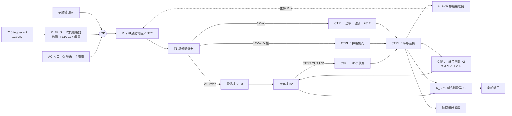

# 14 V0.4 控制與保護板設計草案

> **狀態（2026-09-22）：設計草案。** 有架構、時序、介面、篩選條件與計算；**沒有原理圖、沒有 PCB、沒有 BOM、沒有量測**。需求來源是 [13 喇叭保護與啟停設計計畫](13-喇叭保護與啟停設計計畫.md)，本文件不重複那份的「為什麼」。所有數字由 `tools/control_budget.py` 計算，前提列在該腳本開頭。

## 1. 範圍與已做的決定

V0.4 在 V0.3 的兩片放大板＋一片電源板之外，新增**一片控制板（CTRL）**，集中做五件事：12Vac 輔助電源、一次側軟啟動旁通、喇叭 DC 保護與繼電器、兩聲道靜音控制、Z10 12V trigger 聯動。放大板與電源板**不改電路**，只透過既有的 JP1／JP2、J2／J4、J201／J202 相接。

| 決定 | 內容 | 理由 |
|---|---|---|
| 一片控制板 | 保護、軟啟動、trigger 合在一片 | 三者共用 12Vac 輔助電源與時序；分開做要拉三組線 |
| 方案 A／B 未定 | 先買 UPC1237 模組驗證（13 號文件），本文件是**驗證它的規格書**，也是方案 B 的設計輸入 | 不論最後用模組還是自製，介面與時序都一樣 |
| trigger 繼電器由 Z10 12V 直接供電 | 後級關機時沒有待機電源 | 不必做市電側常通電路；代價是受 Z10 trigger 輸出能力限制，見 §6.7 |
| 靜音由控制板接管 | 每聲道獨立開關元件取代 JP1／JP2 跳線 | 兩個 MUTE 節點維持隔離（既有規則） |
| 掉電偵測取樣點 | 12Vac 整流前 | 時序計算見 §6.4，主軌 DC 取樣不合格 |

## 2. 系統方塊

## 3. 啟停時序

| 步驟 | 事件 | 動作 | 時間（自上一步） | 依據 |
|---|---|---|---|---|
| 上電 1 | Z10 開機或手動開關 | K_TRIG 吸合，市電經 R_s 進變壓器 | 0 | — |
| 上電 2 | 12Vac 出現，CTRL 供電建立 | 靜音維持（開關元件不導通）、K_SPK 保持釋放 | <50ms | 上電預設安全態 |
| 上電 3 | 計時到 | K_BYP 吸合，旁通 R_s | **1s** | §6.2：電容 5τ<0.2s，餘裕給磁化 |
| 上電 4 | 主軌穩定 | 解除靜音（開關元件導通，pin 8 經 R8 接 VEE） | 1～2s | R8·C8＝2.2s 軟上升 |
| 上電 5 | DC 偵測無故障 | K_SPK 吸合 | **3～5s** | 13 號文件 P2 |
| 掉電 | 12Vac 消失 | K_SPK 釋放、靜音同時下達 | <60ms | §6.4：軌壓 1s 內仍 >20V |
| 故障 | 任一聲道 |DC| 超過門檻 | K_SPK 釋放、靜音、狀態燈 | <100ms | 13 號文件 P1 |
| 關機 | trigger 消失或開關斷 | K_TRIG／開關斷 → 進入「掉電」 | — | — |

上電步驟 3 先於 4、5：R_s 若在解除靜音後才旁通，放大器已帶負載，一次側電流大於旁通繼電器的湧流餘裕。

## 4. 與現有板的介面

| 訊號 | 從 | 到 | 電氣條件 | 現有接頭 | 備註 |
|---|---|---|---|---|---|
| 12Vac | T1 第三繞組 | CTRL 輔助電源＋掉電取樣 | 12Vac、≥0.25A rms（§6.5） | 新增 CTRL J301（2P／5.08） | 與 22Vac 繞組隔離要先量 |
| 一次側切換 | CTRL K_TRIG／K_BYP 觸點 | AC 入口→變壓器 | AC250V、≥5A、阻性 | 新增 CTRL J302／J303（一次側，間距≥6.4mm） | **市電區**，與低壓區隔離 |
| 靜音 L／R | CTRL 開關元件 | 放大板 JP1／JP2 位 | 開關耐壓 ≥60V、1.3mA；集極→RUN、射極→VEE | 放大板既有 Header2_P2.54 | 兩路獨立，不可共地短接 |
| 輸出 L／R | 放大板 J2／J4 TEST OUT | CTRL K_SPK 常開觸點與 DC 偵測輸入 | ±36V、≥9A DC 分斷 | 放大板既有 Terminal2_P5.08 | 大電流線不走訊號地 |
| 喇叭 L／R | CTRL K_SPK 觸點 | 面板接線柱 | 同上 | 新增 CTRL J304／J305 | 回線直接回放大板 J2.2／J4.2，不經 CTRL 地 |
| trigger | Z10 3.5mm | CTRL K_TRIG 線圈 | 12VDC、≤50mA | 面板 3.5mm 母座 | trigger 地與訊號地是否相接**待定** |
| 狀態燈 | CTRL | 前面板 | 12V 經限流 | 2P | 綠＝運轉、紅＝保護 |

CTRL 的低壓地（輔助電源負端）接電源板 GND 匯流點**一點**，繼電器線圈電流不流經放大板訊號地（13 號文件既有要求）。

## 5. 各區塊要求

**輔助電源**：12Vac → 全橋 → ≥1000µF／25V → 7812（或 LDO）→ 12V 邏輯與線圈。線圈用未穩壓的 ~15V 或穩壓 12V 依繼電器選擇，見 §6.5。

**軟啟動**：一次側串 R_s（線繞電阻或 NTC），K_BYP 於 1s 後旁通。R_s 要在 K_BYP 不吸合時「燒不起來」（§6.2 失效功率 73～155W），因此**線繞電阻方案必須加熱熔斷或以一次側保險絲保護**；NTC 方案能量額定 ≥58J。

**DC 偵測**：每聲道 RC 低通（截止 1～2Hz）後比較 ±門檻 1～2V，正負都要。取樣點在 K_SPK 之前的放大板側，故障時才量得到。

**掉電偵測**：12Vac 整流前取半波，RC 濾波 20～40ms 後判定消失。

**靜音開關**：每聲道 NPN 或光耦，60V 級，見 §6.6。

**繼電器**：K_SPK ×2 DPDT 或 SPST 各一，DC 分斷 ≥36V／≥9A（§6.3）；K_BYP、K_TRIG AC250V／5A。線圈電壓依 §6.5 統一 DC12V。

**Z10 trigger**：見 §6.7。3.5mm 插座極性（tip＝+12V）以 Z10 手冊確認。

## 6. 計算

以下由 `python3 tools/control_budget.py` 產生；改假設後重跑並整段替換。

### 6.1 儲能與未限流湧流

- 每軌 20000µF；標稱軌壓 28.9V 時每軌儲能 8.4J、兩軌 16.7J；高市電空載 35.8V 時兩軌 25.6J。這是軟啟動元件要吸收的能量下限。
- 未限流時充電峰值只受變壓器繞組電阻與整流橋限制，該電阻**未知**。情境表（次級側總串聯電阻 R，峰值≈√2×22V／R；一次側折算×0.20）：

| 次級迴路 R | 次級峰值 | 一次側折算峰值 | 對 200VA 一次側額定 1.8A 的倍數 |
|---:|---:|---:|---:|
| 0.3Ω | 104A | 20.7A | 11× |
| 0.5Ω | 62A | 12.4A | 7× |
| 1.0Ω | 31A | 6.2A | 3× |
| 2.0Ω | 16A | 3.1A | 2× |

環形變壓器本身在市電相位不利時的鐵心磁化湧流另計，常見 10～50× 額定，與電容充電湧流疊加。這兩項都會讓 110V／15A 迴路的斷路器或一次側保險絲誤動作，**軟啟動列為必要**。

### 6.2 一次側軟啟動（串聯電阻／NTC＋延遲旁通）

一次側額定電流以賣場 200W 估 1.82A（**未驗證**）。串聯電阻 R_s 把一次側峰值壓到 155V／R_s；電阻吸收的能量約等於電容儲能加變壓器損耗，以兩軌儲能 ×1.5 估。旁通前電容經 R_s 折算到次級的等效電阻充電，時間常數 τ = R_s×(22/110)²×C。

| R_s（一次側） | 一次側峰值 | 折算次級 R | τ／軌 | 5τ（充飽） | 吸收能量估 | 建議額定 |
|---:|---:|---:|---:|---:|---:|---|
| 22Ω | 7.1A | 0.88Ω | 18ms | 88ms | 38J | NTC 能量額定 ≥58J 且穩態電流 ≥2.7A；或線繞電阻 ≥10W 脈衝級 |
| 33Ω | 4.7A | 1.32Ω | 26ms | 132ms | 38J | 同上 |
| 47Ω | 3.3A | 1.88Ω | 38ms | 188ms | 38J | 同上 |

- 5τ 都在 0.2s 內，所以旁通延遲 0.5～2s 主要是等變壓器磁化與一次側電流穩定，不是等電容充飽。**建議 1s**。
- 旁通繼電器觸點：AC250V、≥5A、阻性；它切的是穩態一次側電流，不是湧流。
- 只用 NTC 不旁通會持續發熱且熱態阻值隨室溫變，快速關開時 NTC 未冷卻就失去限流。**旁通為必要**。
- 旁通失效模式：繼電器不吸合時 R_s 持續承受一次側電流（22Ω→73W、33Ω→109W、47Ω→155W），必須燒不起來，或以熱熔斷／保險絲保護。

### 6.3 喇叭繼電器 DC 分斷需求

| 軌壓情境 | 8Ω 故障電流 | 4Ω 故障電流 |
|---|---:|---:|
| 標稱 28.9V | 3.61A | 7.23A |
| 高市電空載 35.8V | 4.47A | 8.94A |

選型門檻：**DC 分斷電壓 ≥36V（建議 48VDC 級）、DC 分斷電流 ≥9A（含 4Ω）**，觸點 AgSnO₂／AgNi。標「10A 250VAC」不算，要看廠商曲線裡的 DC 電阻性負載線。兩組觸點串聯給同一聲道可把每觸點分斷電壓減半，值得評估。

### 6.4 掉電時序：軌壓衰減 vs 繼電器釋放

- 靜態每軌負載 ≈ 2×85mA 靜態電流 + 洩放 13mA = 183mA，軌壓衰減率 9.2V/s，從 28.9V 掉到 20V 約 1.0s。
- 12Vac 消失偵測：半波週期 8.3ms，濾波後 20～40ms 內可判定；繼電器釋放 5～15ms。**合計 <60ms，遠小於 1.0s**，所以「從 12Vac 整流前取樣」的關機快斷在時序上成立。
- 若從主軌 DC 取樣，要等軌壓掉到門檻才動作，期間 IC 已進入不對稱供電，這就是 13 號文件禁止的原因。
- 大訊號時每軌電流更大、衰減更快（40W／8Ω 約 2.2A → 110V/s），仍有 0.1s 以上，但靜音應在繼電器釋放同時或之前下達。

### 6.5 12Vac 輔助電源預算

| 負載項（假設） | 電流 |
|---|---:|
| 喇叭繼電器 ×2（DC12V 線圈） | 80mA |
| 軟啟動旁通繼電器 | 40mA |
| 狀態燈與控制邏輯 | 20mA |
| **合計** | **140mA** |

- 全橋整流：標稱峰值 15.6V；高市電空載 18.8V。1000µF 濾波、140mA 時紋波 1.17Vpp，谷值 14.4V，對 7812（需 ≥14V）餘裕 0.4V——足夠但緊，**建議 2200µF**。
- 穩壓器耗散最壞 (18.8−12)×140mA ≈ 0.95W，TO-220 加小散熱片或鎖機殼。
- 12Vac 繞組需求：DC 140mA × 1.6 ≈ 224mA rms，約 2.7VA。**到貨後用已知負載量繞組壓降確認**；12Vac 直入 UPC1237 類模組時，模組自己的整流電容也算在這裡。
- K_TRIG 線圈**不在**這張表，它由 Z10 供電。

### 6.6 既有靜音支路交給控制板

- VEE = −28.9V：I_mute = 1.28mA；−25.0V：1.10mA；−35.8V：1.59mA。全部 ≥0.5mA，符合 TI 要求。
- R8×C8 = 2.2s：解除靜音的軟上升時間常數，與喇叭繼電器 3～5s 延遲相容。
- 控制板取代 JP1／JP2：每聲道各一顆 NPN／光耦，集極接 R8 的 RUN 端、射極接 VEE，耐壓選 60V 級，開關電流僅 1.3mA。**左右兩顆各自獨立，兩個 MUTE 節點仍不相接。** 板上 JP1／JP2 保留為手動測試位。

### 6.7 Z10 12V trigger 直接驅動一次側繼電器

- 拓樸：Z10 trigger out（12VDC）→ 3.5mm 插座 → 串聯二極體（防反接）→ DC12V 繼電器線圈 ‖ 續流二極體 → trigger 地。**線圈電源就是 Z10 的 12V**，後級關機時不需要任何待機電源，符合 01 號文件「不需額外 PCB」的預留。
- 手動總開關與繼電器觸點**並聯**（OR），總開關前另有 AC 入口保險絲與主開關。
- 線圈電流上限取決於 Z10 trigger 輸出能力，**原廠規格未取得**。門檻：線圈 ≤50mA（DC12V、≥240Ω）。若 Z10 只能供 ≤20mA，改成「觸發鎖住」：trigger 只負責吸合，吸合後由 12Vac 輔助電源自保持，trigger 消失時由控制板釋放；這會多一組觸點與一條邏輯。
- 一次側繼電器觸點：AC250V、≥5A、阻性；串在 R_s 之前。

## 7. 繼電器採購篩選清單

拿去對商品頁，**任一項查不到就不買**：

- [ ] 觸點 DC 分斷曲線或明列「≥36VDC／≥9A 阻性」（K_SPK）
- [ ] 觸點材質 AgSnO₂ 或 AgNi（K_SPK）
- [ ] 線圈 DC12V，額定電流有數字（三種繼電器都要，加總回填 §6.5）
- [ ] 線圈在 15～16V 未穩壓下的耐受，或確定用穩壓 12V
- [ ] K_BYP／K_TRIG：AC250V ≥5A 阻性，一次側與線圈間絕緣 ≥2.5kV
- [ ] 腳位圖（PCB 封裝要畫）
- [ ] K_TRIG 線圈 ≥240Ω（§6.7 門檻），等 Z10 trigger 規格確認後才定

## 8. 等變壓器到貨才能定的事

| 待量 | 影響 |
|---|---|
| 12Vac 繞組是否存在、與 22Vac 隔離、空載電壓 | 整個 CTRL 供電方案 |
| 12Vac 帶載壓降（推 VA） | §6.5 是否成立、能不能直入模組 |
| 一次側空載電流、繞組電阻 | §6.1 的 R、R_s 選值 |
| Z10 trigger 輸出電壓／電流（手冊或實測） | §6.7 直驅或鎖住 |
| 主軌實測衰減曲線 | §6.4 驗證 |

量法：三組繞組逐一空載量 Vrms 與線間隔離（>1MΩ）；12Vac 掛 47Ω／5W 負載（≈0.25A）量壓降；一次側串電流表量空載電流。全部寫回 [00 採購總表](00-採購總表.md) §1 的到貨核對欄與本文件 §6 的假設。

## 9. 方案 A 模組（UPC1237）到貨驗證清單

1. 反推電路圖，確認正負 DC 都偵測、掉電取樣點在 AC 側。
2. 量延遲時間、DC 門檻（正負各一）、掉電釋放時間。
3. 查板上繼電器料號的 DC 分斷規格，對 §6.3。**幾乎一定不合格**，屆時換繼電器或轉方案 B。
4. 量 AC12V 輸入電流，對 §6.5。
5. 模組**沒有**軟啟動與 trigger，這兩塊無論如何要自製或另買。

## 參考

[TI LM3886 SNAS091](https://www.ti.com/lit/ds/symlink/lm3886.pdf) §Mute Function；[13 喇叭保護與啟停設計計畫](13-喇叭保護與啟停設計計畫.md)；[05 內建電源與機構](05-內建電源與機構.md)；[04 上電與驗收](04-上電與驗收.md) §5 啟停測試待依本文件 §3 擴充。
