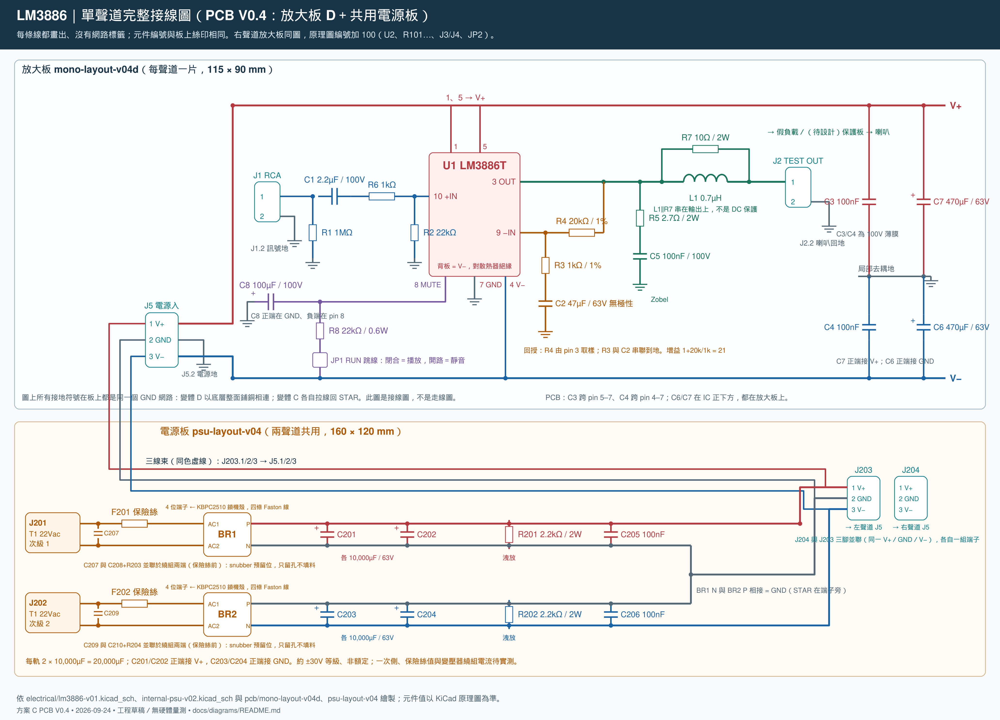

# 方案 C 電路導讀圖（PCB V0.4）

更新：2026-09-24。新增**單聲道完整接線圖**（每條線都畫出、沒有網路標籤、元件編號＝板上絲印），取代舊的「完整電路總覽」；其餘四張向量圖與兩張色塊圖重建，底圖改用 2026-09-24 匯出的 KiCad PDF（電源圖含 J204 與 snubber 預留位）。舊總覽移到 [archive-v03/](archive-v03/)。沒有新增硬體量測或重跑 ERC／DRC。

| 圖片 | 內容 |
|---|---|
| [單聲道完整接線圖](lm3886_full_v04.png) | 放大板 D（22 件）＋共用電源板（22 件）全部畫出；電源、去耦、靜音、回授、Zobel、線束都在同一張 |
| [輸入級與回授](lm3886_input_stage.png) | R1/C1/R6/R2、R4 回授與串聯 R3/C2 |
| [IC → 輸出級](lm3886_ic_to_output.png) | Zobel、L1∥R7、假負載及回授取樣點 |
| [電源級 → IC](lm3886_power_to_ic.png) | 雙橋四電容、極性、線束、去耦與靜音 |
| [放大板色塊導讀](lm3886_sch_annotated.png) | 現行雙聲道 KiCad 原理圖的向量底圖與功能分區 |
| [電源板色塊導讀](lm3886_psu_sch_annotated.png) | 現行次級 KiCad 原理圖（含 J204、snubber 預留）的向量底圖與功能分區 |



## 為什麼要另畫一張接線圖

KiCad 原理圖（`electrical/*.kicad_sch`）電氣上是完整的，PCB 就是從它匯出的網路表建的；但它用 VCC／GND／VEE／L_MUTE 等**網路標籤**代替實際畫線，去耦電容、靜音電路、C2 都孤立擺在旁邊，看起來像沒接。接線圖把這些線全部畫出來，並標出哪些零件在放大板、哪些在電源板、線束怎麼接。**元件值以 KiCad 原理圖為準**；接線圖是導讀，不是走線圖，所有接地符號在板上是同一個 GND 網路（變體 D 以底層鋪銅相連、變體 C 各自拉線回 STAR）。

## 與 V0.3 導讀圖不同之處

- 電源板加了 J204（右聲道端子）與每繞組的 snubber 預留位（Cx‖(Rs+Cs)，只留孔不填料）。
- 整流橋定案 KBPC2510 鎖機殼，板上是 4 位端子，四條 Faston 線接入。
- PCB 對應文字改為 V0.4：C3 跨 pin 5–7、C4 跨 pin 4–7 貼 IC 腳；變體 D 底層整面接地、主輸出走頂層。
- 採購狀態改為 9/22 到貨後的現況；電路、元件值與網路沿用 V0.3 未改。

## 來源與核對

電路以 [放大板](../../electrical/lm3886-v01.kicad_sch)、[次級電源](../../electrical/internal-psu-v02.kicad_sch) 及各自生成器為準。色塊底圖直接從 `electrical/preview/` 的向量 PDF 轉出，沒有重新猜畫原理圖。接線圖依原理圖網路表與 [PCB V0.4](../../pcb/README.md) 的元件編號手繪，逐一核對 54＋50 個焊盤網路（見 [pcb/inspection-v04](../../pcb/inspection-v04/drawings/)）。這是文件同步，不代表新的電氣驗證或製造核准。

## 重建

可編輯原稿位於 [svg/](svg/)，SHA-256 來源清單在 [sources.json](sources.json)（綁四個生成器與兩份 PDF，不綁 `.kicad_sch`）。需要 Python 3 與 PyMuPDF；PNG 轉檔改用 `render_diagrams.py`（PyMuPDF），不再需要 Node.js／sharp（`render_diagrams.cjs` 保留可用）。中文字型預設 Microsoft JhengHei，其他平台需 Noto Sans CJK TC。

```sh
py -3.13 -X utf8 tools/build_diagrams.py          # 五張導讀圖 SVG + sources.json
py -3.13 -X utf8 tools/build_diagram_full_v04.py  # 單聲道完整接線圖 SVG + PNG
py -3.13 -X utf8 tools/render_diagrams.py         # 全部 SVG -> PNG
```

若改動電路，先依專案流程重建 KiCad 原理圖、netlist、PDF 與電氣檢查，再同步兩支生成器的導讀內容，重建並逐張檢視。色塊圖的彩色框座標是依當前 PDF 版面手調的，PDF 版面變動後要重新對位。
