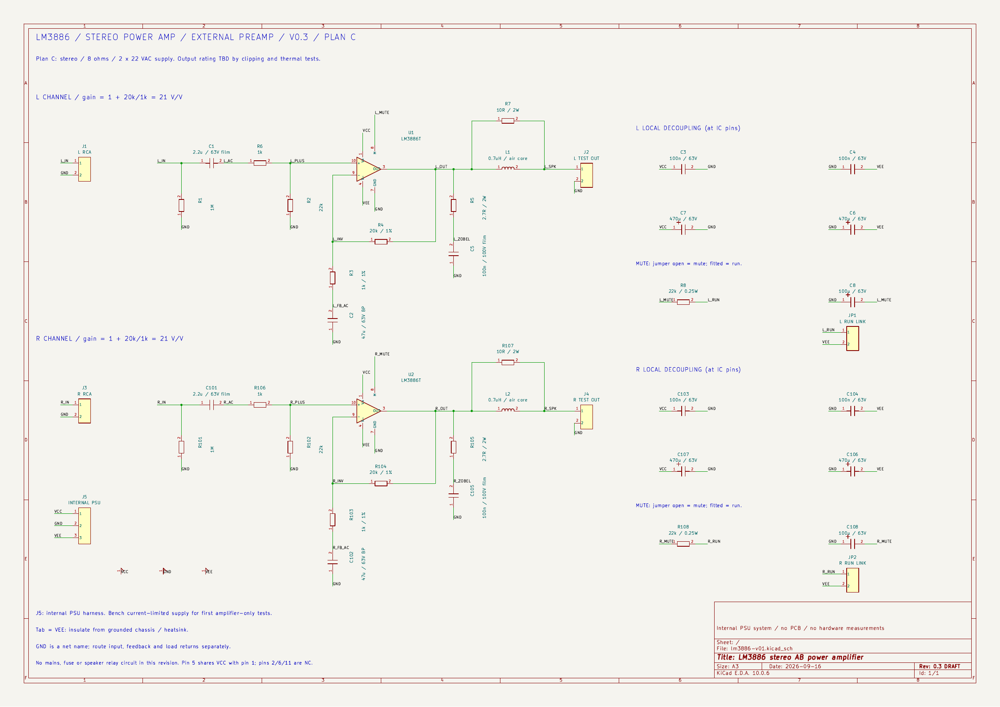
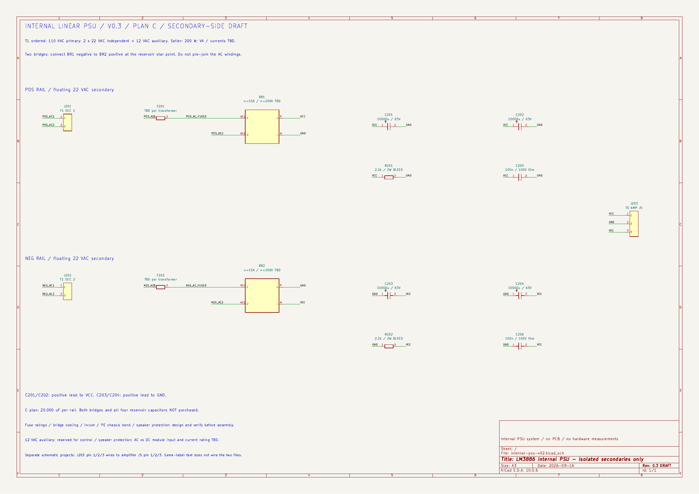

# V0.3 放大板與內建電源次級圖

> 2026-09-16：本目錄兩份圖面、PDF／PNG 與計算已更新成 V0.3 C 方案；檔名保留以維持連結。12Vac 控制／一次側仍待設計，電氣檢查結果見 validation.md。

[下載 PDF](preview/lm3886-v01.pdf)。以 KiCad 10 開啟 [lm3886-v01.kicad_pro](lm3886-v01.kicad_pro)，即可編輯原理圖；自有符號庫已隨附。未指派 footprint，尚無 PCB。

放大板檔名保留 `lm3886-v01` 以維持既有連結，圖框版本已更新為 V0.3。J5 現在表示機內電源線束，日常使用由內建電源供電，訊號由現有前級送入。

[電源 PDF](preview/internal-psu-v02.pdf) · [電源 KiCad 專案](internal-psu-v02.kicad_pro) · [電源 BOM](psu-bom-draft.csv)。這份圖只畫變壓器隔離次級之後的整流、濾波與洩放，市電一次側及軟啟動仍在[整機規劃](../docs/05-internal-power.md)階段。

電源 J203 的 1／2／3 與放大板 J5 的 1／2／3 用線束相接。兩份圖是獨立 KiCad 專案，不靠同名網路自動跨檔連線。橋式整流符號的 AC1／AC2／P／N 是功能端子，選實體料件後再對應腳位。

左右各一套相同電路，RCA／電源／靜音間相同的網路名稱表示電氣相接。IC 1、5 兩腳共用正電源符號位置，2、6、11 是隱藏的 NC 腳；匯出 netlist 會分別核對。

本版 C2／C102 為無極性回授電容；C6／C106 負軌電解及 C8／C108 靜音電解的正端接 GND。輸出標記 TEST OUT，供假負載使用。

在專案根目錄執行 `python3 tools/rebuild.py` 會重建兩份原理圖、ERC、netlist、BOM、PDF、PNG、功率／市電報告與驗證紀錄。生成器會覆寫原理圖；手動修改後需先同步修改生成器，或明確改成以 KiCad 手動檔為主，避免覆蓋人工編輯。

[BOM](bom-draft.csv) · [驗證紀錄](validation.md) · [中文設計說明](../docs/01-design.md)
