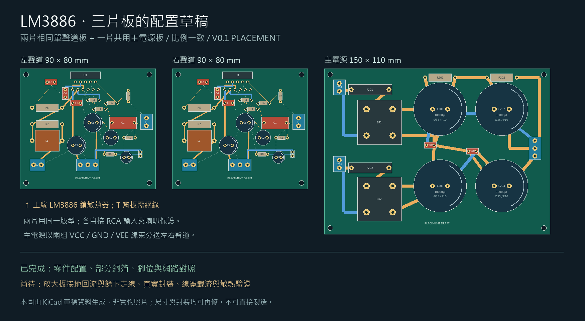

# PCB 配置草稿 V0.1

2026-09-16。依使用者同意的 PCB A 選項：兩片相同單聲道板＋一片共用電源板，延續系統 C 方案。只有變壓器與 LM3886T 已下單，其餘元件未購。



| 板子 | 暫定尺寸 | 使用數量 | 可編輯檔 |
|---|---|---|---|
| 單聲道功率板 | 90 × 80 mm | 2 | [KiCad PCB](mono-placement-v01.kicad_pcb) |
| 雙橋四電容電源板 | 150 × 110 mm | 1 | [KiCad PCB](psu-placement-v01.kicad_pcb) |

這是配置與部分走線草稿，不能直接製造或依此接電。尚無 Gerber、實體 PCB 或實機測試。PNG 由同一份 PCB 配置資料繪製；原生 KiCad SVG 另存 mono-native.svg、psu-native.svg。圖中相對位置不代表最終機殼配置。

## 已做的核對

- KiCad 10.0.6 可重新載入兩份 PCB；單聲道 54 個與電源 35 個電氣焊盤的網路，已比對原理圖匯出的 netlist。
- 單聲道：預設 DRC 規則下 0 個幾何違規、14 個未連通項目，包含 GND、MUTE、VEE，仍須完成回流與層間連接。
- 電源：預設 DRC 規則下 0 個幾何違規、0 個未連通項目。這只代表目前規則下的幾何與連通檢查；接地匯流點、充電脈衝回路、線寬載流與溫升尚未驗證。
- 完整機器輸出見 mono-drc.json、psu-drc.json，包括預設未啟用的檢查。尚未建立完整 courtyard 與製造商規則，不能據此宣稱可製造。
- 左右聲道元件對照見 mono-channel-mapping.csv；電源 J203 須經外部線束分送兩板 J5，尚未設計線束端接細節。

## 封裝與後續修改

所有 footprint 都是暫定尺寸，清單見 footprint-assumptions.csv；Draft.pretty 為隨附可編輯庫。

1. LM3886T 的 11 腳排列、引腳彎折與散熱器位置，必須依到料及 [TI datasheet](https://www.ti.com/lit/ds/symlink/lm3886.pdf) 的 T 封裝圖確認。T 背板與負電源相關，與共用散熱器的絕緣結構尚待設計。
2. 整流橋使用 AC1／AC2／P／N 邏輯腳名占位，並非已核對的 KBPC2510 封裝。選定整流橋後需重配實體腳位；若採接片或機殼固定型，可能改為板外整流橋及接線端子。
3. 四顆 10,000µF／63V 暫用直徑 35 mm、腳距 10 mm；未決定品牌料號。實際尺寸會改變電源板大小。
4. 接頭、保險絲座、輸出電感、電阻電容及四角 M3 孔的位置均待實物核對。雙層、板厚 1.6 mm 為草稿假設，銅厚未定。
5. 完成放大板接地、回授與輸出迴路審查；重新規劃電源板大電流回路與接地匯流點，再按銅厚／電流／溫升決定線寬。
6. 市電一次側、12Vac 輔助電源、浪湧限制、喇叭保護與控制不在這兩個 PCB 檔內，需另行設計。

## 重建

先依 electrical/README.md 產生 netlist，再用含 pcbnew 的 KiCad Python 執行：

```sh
python3 tools/build_pcb_draft.py
kicad-cli pcb drc --format json -o pcb/mono-drc.json pcb/mono-placement-v01.kicad_pcb
kicad-cli pcb drc --format json -o pcb/psu-drc.json pcb/psu-placement-v01.kicad_pcb
```

PNG：以裝有 Pillow 的 Windows Python 執行 `tools/render_pcb_draft.py`，目前使用 Windows 微軟正黑體。生成器會覆寫 PCB 草稿；手動修改前請先另存版本。原理圖仍為 V0.3，現有 V0.3 PDF 是加入 PCB 前的快照，未收錄本次草稿。
