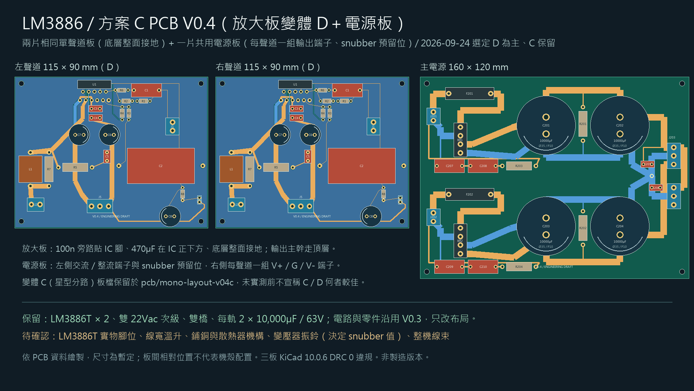
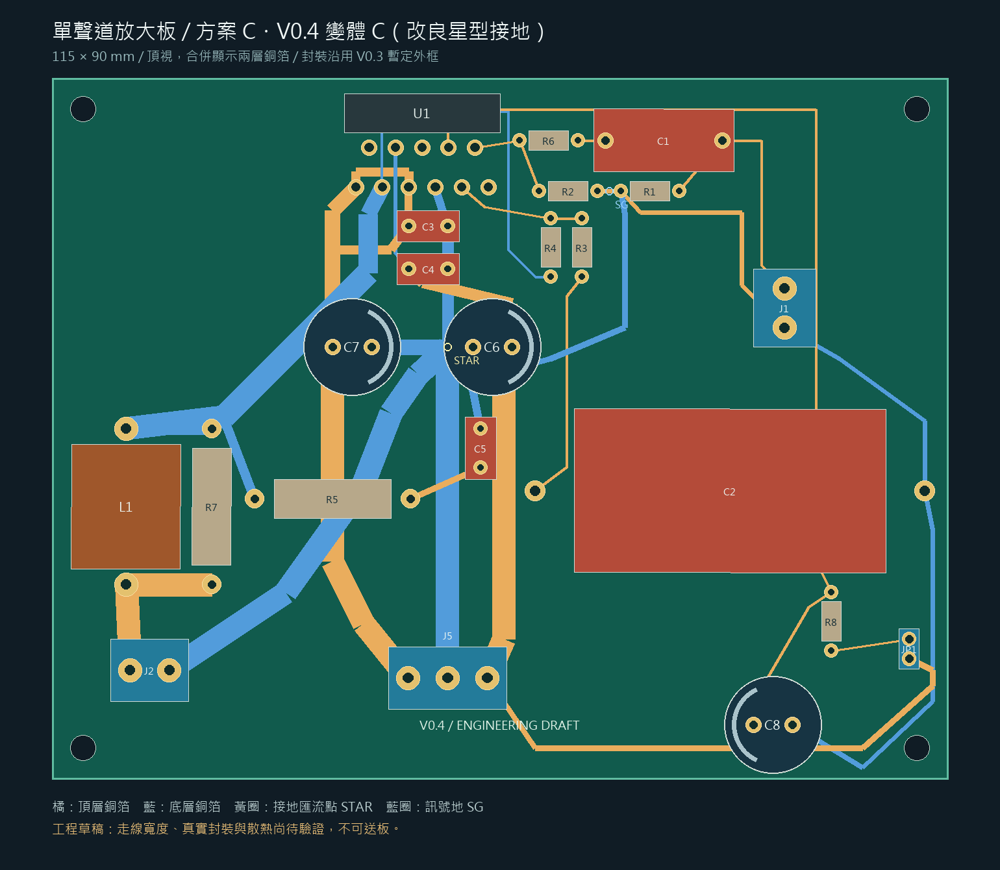
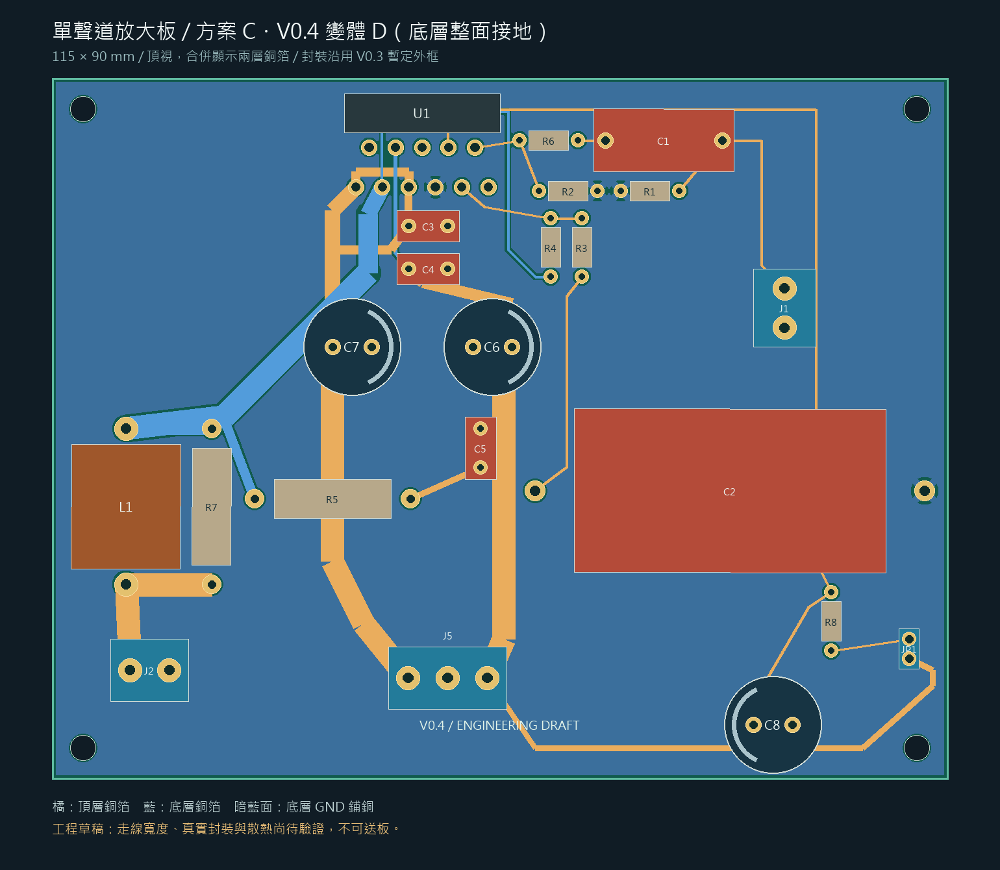
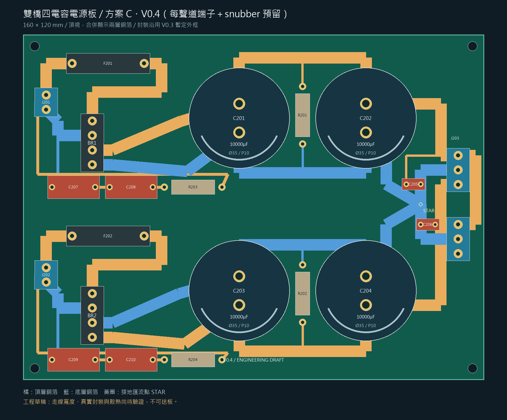

# PCB

**現行版本是 V0.4**（2026-09-24：放大板變體 D 為主、變體 C 保留、電源板加每聲道端子與 snubber 預留位），三板 KiCad 10.0.6 DRC 0 違規、0 未連通，見下方「PCB V0.4」各節；正反面銅箔、組裝極性、3D 預覽與零件核對表在 [inspection-v04](inspection-v04/README.md)。**V0.3 自 2026-09-24 起為歷史版本**：板檔、DRC、雜湊綁定與審查結論原樣保留供對照，不再修改。



---

## PCB V0.3（B 方案，歷史版本）

**兩片 100×90 mm 單聲道放大板＋一片 160×120 mm 共用電源板。**（2026-09-24 放大板已改為 **115×90 mm** 並重建，DRC 0 違規、0 未連通。）

> ⚠️ **工程草稿，不可送製。** 兩板在 KiCad 10.0.6 下 0 DRC 違規、0 未連通，54＋35 焊盤網路與原理圖相符；但封裝是暫定外框與假設高度，溫升、散熱、機構與線束都沒驗證，**沒有 Gerber**。DRC 與中心線幾何不代表高頻穩定、載流溫升或製造條件已驗證。


| 項目 | 單聲道板 ×2 | 電源板 ×1 |
|---|---|---|
| 可編輯 PCB | [mono-layout-v03.kicad_pcb](mono-layout-v03.kicad_pcb) | [psu-layout-v03.kicad_pcb](psu-layout-v03.kicad_pcb) |
| 專案規則 | [KiCad 專案](mono-layout-v03.kicad_pro) | [KiCad 專案](psu-layout-v03.kicad_pro) |
| 圖面 | [PNG](preview/mono-layout-v03.png)／[原生 SVG](preview/mono-v03-native.svg) | [PNG](preview/psu-layout-v03.png)／[原生 SVG](preview/psu-v03-native.svg) |
| 封裝假設 | [清單](mono-layout-v03-footprints.csv) | [清單](psu-layout-v03-footprints.csv) |
| 原生 DRC | [0 違規、0 未連通](mono-v03-drc.json) | [0 違規、0 未連通](psu-v03-drc.json) |

其他資料：[銅箔計算表](current-budget-v03.md)／[完整計算資料與輸入雜湊](current-budget-v03.json)、[驗證摘要](validation-v03.json)、[DRC 檔案綁定](drc-provenance-v03.json)、[正反面／組裝／3D 看圖資料](inspection-v03/README.md)、[零件與封裝核對表](inspection-v03/parts-audit.md)、[左右聲道對照](mono-channel-mapping.csv)。

V0.1／V0.2 板檔、封裝庫與舊腳本已於 2026-09-21 刪除，從 Git 歷史（`41b217c`）取回；僅保留 `archive/v02/*-layout-v02.json` 供 `analyze_pcb_v03.py` 做 V0.2→V0.3 對照。

## PCB V0.4 放大板・變體 C（改良星型接地，2026-09-24 晚）

> ⚠️ **工程草稿，不可送製。** 電路、零件與封裝外框全部沿用 V0.3；只改零件位置與銅箔。KiCad 10.0.6 下 **0 DRC 違規、0 未連通**，54 焊盤網路與原理圖相符，接地分路檢查通過（[validation-v04.json](validation-v04.json)）。變體 D 與電源板 V0.4 見後兩節；**使用者 2026-09-24 選定 D 為主，C 保留備查**。



| 項目 | 檔案 |
|---|---|
| 可編輯 PCB／專案 | [mono-layout-v04c.kicad_pcb](mono-layout-v04c.kicad_pcb)／[.kicad_pro](mono-layout-v04c.kicad_pro) |
| 位置與逐段走線定義 | [tools/pcb_layout_v04.py](../tools/pcb_layout_v04.py)（生成器 [build_pcb_v04.py](../tools/build_pcb_v04.py) 沿用 V0.3 封裝庫與 `build()`） |
| 原生 DRC／驗證 | [mono-v04c-drc.json](mono-v04c-drc.json)／[validation-v04.json](validation-v04.json)（`verify_pcb_v04.py`，匯合半徑 5 mm，V0.3 為 4 mm） |
| 走線資料／封裝清單 | [mono-layout-v04c.json](mono-layout-v04c.json)／[footprints.csv](mono-layout-v04c-footprints.csv) |

**改了什麼（對應 2026-09-24 審 V0.3 的七點中屬於放大板的五點）：**

1. 100n 旁路貼 IC 腳：C3 (45.8,19) 跨 pin 5 (V+)–pin 7 (GND)，C4 (50.8,24.5) 跨 pin 4 (V-)–pin 7；V- 從 pin 3／pin 5 之間以 0.5 mm 底層線直下 pin 4（IC 腳間隙 1.4 mm 只容得下這個寬度，是全板最窄處）。
2. 470µF C7 (36,34.5)／C6 (54,34.5) 上移到 IC 正下方，**STAR (50.8,34.5) 就是兩顆之間 9 mm 長的接地條**；J5 留板底，GND 以 3 mm 底層線沿 x=50.8 直上 STAR。
3. J1 訊號與接地並排走到 C1／R1／R2 角落，R1.1 與 R2.1 相鄰 3 mm 形成訊號地 SG (71.5,14.5)，再一條 0.8 mm 底層線回 STAR；C2 與 C8 的接地併入這條訊號地分路（靜音電容只有 mA 級，不再另走一路）。
4. Zobel C5 移到 (55,45)，接地 1.0 mm 直入 STAR；R5 輸出端接到輸出主幹的轉折點 (22,43.5)。
5. C2 改平放在右半 (112,53)，C2.2 靠 R3.1；R8／C8／JP1 移到右下角。**4 個過孔全部取消**（V0.3 有 3 個），每個網路都在單層走完或用零件焊盤換層。

| 銅箔中心線長度（mm） | V0.3 | V0.4 C |
|---|---:|---:|
| C3 接地端→U1.7 | 24.2 | **5.2** |
| C4 接地端→U1.7 | 33.2 | **10.7** |
| C3 旁路迴路（U1.5→C3.1＋C3.2→U1.7） | 43.6 | **10.2** |
| C4 旁路迴路（U1.4→C4.2＋C4.1→U1.7） | 50.2 | **27.0** |
| C6 接地端→STAR | 16.5 | **3.2** |
| C7 接地端→STAR | 11.5 | 9.8 |
| Zobel C5 接地端→STAR | 72.1 | **11.5** |
| J1 接地→STAR（訊號地） | 64.6 | 76.5 |
| C2 接地→STAR（訊號地） | 69.7 | 107.1 |
| J5 接地→STAR | 27.4 | 42.5 |
| U1.3→L1.1 輸出主幹 | 48.8 | 50.2 |
| U1.3→R4.2 回授取樣線 | 7.1 | **50.4** |
| U1.9→R4.1（-IN） | 5.5 | 12.5 |

粗體是本輪目標項。**代價**（有意為之、可再議）：回授取樣線改由 pin 3 向上穿過 pin 2／pin 4 之間，沿 IC 本體下方（y=4.3，底層）繞到右側 R4，長 50 mm——它是低阻抗的輸出取樣，長度本身影響小，但與 -IN 線的 12.5 mm 一起，比 V0.3 多暴露在 IC 附近；訊號地與 J5 回流變長是把 STAR 上移到 IC 下方的直接結果。這些都是中心線幾何，**不代表失真或穩定度已改善**，要等實板量。

**還沒做：** 變體 D（同位置、底層整面 GND 鋪銅取代分支；`verify` 的分路檢查對 D 要跳過）、電源板 V0.4（原理圖已加 J204／snubber，PCB 未畫）、V0.4 的 `current-budget`／`analyze` 對照、3D 與導讀圖。V0.3 板檔與雜湊全部未動。

### 變體 D（底層整面接地，2026-09-24 深夜）

零件位置、訊號與電源銅箔與變體 C **完全相同**；只把 C 的全部 GND 分路線拿掉，改成一整片底層 GND 鋪銅（`AMP_D`，間距 0.3、最小寬 0.35、焊盤熱阻隔 spoke 0.8／gap 0.5）。KiCad 10.0.6 **0 DRC 違規、0 未連通**，鋪銅填完只有一個連通區（沒有孤島）；`verify_pcb_v04.py` 對 D 跳過分路檢查，只核對焊盤網路與鋪銅連通區數。



| 項目 | 檔案 |
|---|---|
| 可編輯 PCB／專案 | [mono-layout-v04d.kicad_pcb](mono-layout-v04d.kicad_pcb)／[.kicad_pro](mono-layout-v04d.kicad_pro) |
| 原生 DRC／走線＋鋪銅資料 | [mono-v04d-drc.json](mono-v04d-drc.json)／[mono-layout-v04d.json](mono-layout-v04d.json)（含填銅多邊形） |

**2026-09-24 使用者決定：以 D 為主、C 保留。** 隨即修掉 D 的缺點：3 mm 輸出主幹（pin 3→L1）與 Zobel 接主幹的線改走**頂層**，C7→pin 1 的 V+ 進線改走底層（只在 x=36 切一道 20 mm 的短縫），原本多給 C3.1 的一條 V+ 分支拿掉（C3.1 由 pin 1→pin 5 連線供電）。修後底層鋪銅仍是單一連通區，板左半改由 C7 下方整片相連，不再只靠窄帶；DRC 0 違規、0 未連通。C 與 D 的取捨（星型分路 vs 整面低阻抗回流）沒有實測前不能說哪個一定好，所以 C 的板檔照樣留著。

### 電源板 V0.4（每聲道端子＋snubber 預留，2026-09-24 深夜）

AC 進線、保險絲、橋堆端子、四顆 10,000µF、洩放電阻的位置與 V0.3 相同，對應 2026-09-24 審查的第 5、6 點：

- **J203（左聲道）／J204（右聲道）各一組 3P 端子**在右板邊 (151,42)／(151,66)。STAR 移到 (138,59.08)，C202／C204 的接地各一條 4 mm 底層線斜入 STAR，再各一條 4 mm 線到兩個端子的 G 腳；V+ 走頂層 x=145 到 J203 再沿板邊 x=157 到 J204，V- 走頂層 x=145 從底部上來分別接兩個端子。C205／C206 100n 貼在 STAR 旁。
- **每繞組一組 snubber 預留位**（Cx‖(Rs+Cs)）排在橋堆端子下方一列：C207／C208／R203 在 y=53，C209／C210／R204 在 y=113。接在保險絲**前**的繞組兩端（J201／J202 那一側），1 mm 細線；Cx、Cs 用 `Film_P15`、Rs 用 `R_2W_P20` 暫代，**只留孔不填料**，等變壓器實測振鈴再決定值與是否裝。
- KiCad 10.0.6 **0 DRC 違規、0 未連通**，50 焊盤網路與 V0.4 電源原理圖相符（[psu-v04-drc.json](psu-v04-drc.json)、[validation-v04.json](validation-v04.json)）。負半邊的 snubber 回線原本與 V- 充電線（4 mm）重疊 0.2 mm，改到 y=110.6 後通過。



| 項目 | 檔案 |
|---|---|
| 可編輯 PCB／專案 | [psu-layout-v04.kicad_pcb](psu-layout-v04.kicad_pcb)／[.kicad_pro](psu-layout-v04.kicad_pro) |
| 位置與走線定義 | [tools/pcb_layout_v04_psu.py](../tools/pcb_layout_v04_psu.py) |
| 原生 DRC／走線資料／封裝清單 | [psu-v04-drc.json](psu-v04-drc.json)／[psu-layout-v04.json](psu-layout-v04.json)／[footprints.csv](psu-layout-v04-footprints.csv) |

**V0.4 三塊板都畫完了（放大板 C、放大板 D、電源板）**，等使用者看圖選 C 或 D。之後才做：V0.4 的 `current-budget`／`analyze` 對照、3D 與導讀圖、系統並排圖；V0.3 檔案與雜湊全部未動。

## 審查結論（2026-09-17，以 V0.2 `d39b623` 為比較基準）

**改了什麼：** C3/C4 的高頻回地改在 IC 附近接至 U1.7，再由獨立局部去耦地線回匯流區，輸入／回授仍走自己的低電平支路；主輸出改走 B.Cu，R4 取樣仍由 U1.3 單獨走 F.Cu；放大板主電流段加寬（主幹 3.0 mm），電源板 AC／DC 主幹由 2.0／3.0 加寬至 4.0 mm；**移除正電源上的兩個換層導通孔**，剩下 3 孔只用於靜音與 Zobel 地線，不在主供電或喇叭電流路徑上；固定生成後的專案規則並加入 DRC 前後設定核對與檔案雜湊綁定。沒有改增益、元件值或電路網路。

| 量化結果 | V0.2 | V0.3 |
|---|---:|---:|
| C3 地端→U1.7 中心線路徑 | 102.94 mm | 24.15 mm |
| C4 地端→U1.7 中心線路徑 | 126.16 mm | 33.15 mm |
| C3→U1.1 電源線＋回地線總長 | 110.55 mm | 32.76 mm |
| C4→U1.4 電源線＋回地線總長 | 147.18 mm | 50.17 mm |
| U1.3→L1.1 走線電阻（1 oz／25°C） | 20.93 mΩ | 9.25 mΩ |
| 正電源 J5→U1.5 走線電阻 | 33.41 mΩ | 22.98 mΩ |
| 負電源 J5→U1.4 走線電阻 | 30.33 mΩ | 26.77 mΩ |

這些是**銅箔中心線的幾何與電阻指標**，不是完整換流迴路、電感或阻抗值，**不能換算成失真改善比例或不振盪保證**。計算條件：±30V、每聲道 40W／8Ω 正弦（40W 是走線尺寸計算點，不是額定）、每軌 85mA 靜態電流、`R = ρΣ(L/W)/t × [1+α(T−25)]`（ρ=17×10⁻⁶ Ω·mm，α=0.0039/°C）、名義 1 oz／2 oz 銅厚 0.0348／0.0696 mm，並以 25°C／85°C 作敏感度比較——**85°C 是輸入值，不是算出來的溫度**。孔壁、焊點、接頭、線材與元件電阻未併入。依據 [TI LM3886 datasheet pp.20–22](https://www.ti.com/lit/ds/symlink/lm3886.pdf) 與 [TI Analog Engineer's Pocket Reference](https://www.ti.com/seclit/eb/slyw038c/slyw038c.pdf)。

**整流充電只有情境、沒有預測。** 變壓器繞組電阻、漏感、空載電壓、橋壓降與電容 ESR 都未知，採矩形脈衝敏感度模型 `Ipeak=Idc/d`、`Irms=Idc/√d`：d=15% 時每軌平均 2.183A、RMS 5.637A、峰值 14.554A；d=35% 時 RMS 3.690A、峰值 6.238A。**這不是實測預測也不是保證上界**，到貨後波形可能超出。保險絲到橋的 50 mm AC 銅箔加寬到 4.0 mm 後，15% 情境下發熱由 0.388 降至 0.194 W，所以本輪優先加寬 AC 線而不只加寬 DC 輸出。

**本輪算的是發熱功率 W，不是溫升 °C**；實際溫升還取決於成品銅厚、板材、鄰近發熱零件、機殼溫度與通風。沒有使用 [IPC-2152](https://www.ipc.org/TOC/IPC-2152.pdf) 完整圖表，不宣稱符合該標準。

**規則重設問題的更正：** V0.2 生成器的 `SaveBoard` 會重建同名 `.kicad_pro` 把人工設定還原，已發布的 V0.2 實際是 Default 網路類別 0.2 mm，不是舊文字宣稱的 0.3 mm。V0.3 在所有 PCB 儲存後才寫入規則，`run_pcb_drc_v03.py` 於執行前後檢查 0.30 mm 間距、0.35 mm 線寬、0.50 mm 板邊距、0.20 mm 導通孔環寬、0.15 mm 絲印間距，並綁定 DRC／PCB／專案／走線 JSON 的 SHA-256。

**2026-09-19 絲印組裝標記（僅改封裝庫與生成器，板檔未重建）：** `DraftV03.pretty` 的 `CP_D12.5_P5`／`CP_D8_P3.5`／`CP_D35_P10` 加上「+」記號與負極粗條，`LM3886T_UNVERIFIED` 加上 pad 1 標記與「TAB = V- HEATSINK」字樣。幾何集中在 [tools/silk_marks_v03.py](../tools/silk_marks_v03.py)，重建時自動寫入；**兩份 `.kicad_pcb`、預覽圖與 DRC 雜湊未變**，要在 KiCad 環境跑完下方指令才會出現在板面。C8 極性依 mute 拓樸推定，到料後再核對。

**2026-09-24 橋堆裝法定案（方案 A）：** 使用者比較兩張預覽（A 鎖機殼＋4 位端子／B KBPC-W 焊板）後選 A。`Bridge_LOGICAL_UNVERIFIED` 移除，改 `BridgeTerminal4_P5.08`（焊盤編號沿用 AC1／AC2／P／N，原理圖不必改），BR1／BR2 位置 (24,30)／(24,90) 轉 270°，四條進出走線各加一個轉折點以避免 4 mm 寬線壓到相鄰端子。電源板重建後 DRC 0 違規、0 未連通。

**2026-09-23 依實量改（2026-09-24 已重建）：** ROE EGW 47µF 實量軸向 40×Ø20、腳徑約 0.8–1.0 → 新增 `BP_Axial_L40_D20_P50`（腳距 50、鑽孔 1.2、焊盤 2.6、外框 40×21），C2 躺式直放於 (70.5,80) 轉 90°，C2.2 在上方距 R3.1 約 10 mm、C2.1 在下方以 1.0 mm B.Cu 回 SG；放大板 100→**115×90**，R8／C8／JP1 右移至新增區（R8 100,48／C8 103,66 轉 180／JP1 110,52），R2 接地改繞 (76,26)(76,43) 避開 C2.2，靜音供電 VEE 改走 F.Cu 沿 y=76 避開 C2.1 接地線。`CP_D12.5_P5` 鑽孔 0.9→1.0（EKE、361R 腳徑 0.8）。**2026-09-24 KiCad 重建結果：** 首輪 DRC 抓到 C2 與 R1 零件保留區重疊（C2 由 x=72 移到 70.5 解決），以及 9/19 絲印那輪留下的兩個警告（U1「TAB」字高 0.7→0.8、U1 位號移到 (60,3) 不再壓字）；`verify_pcb_v03.py` 抓到 C2 訊號地與靜音回流在 (72,56) 相碰（同為 GND，DRC 不報，但違反「分路只在 STAR 匯合」），靜音回流改為 C8.1→F.Cu→`via_mute_ret` (62,71)→B.Cu→STAR。修正後兩板 0 違規、0 未連通、回地分組通過。走線寬度與訊號完整性仍只是工程假設。C2 本體下方有 F.Cu（L_MUTE、靜音回流）與 B.Cu 走線及 `via_mute_ret`；EGW 為絕緣套管軸向件，靠阻焊隔離，組裝時不要刮傷套管。

**2026-09-22 依型錄改封裝庫與生成器（板檔未重建，比照 9/19 絲印那輪）：** `LM3886T_UNVERIFIED` 鑽孔 0.9→1.1、焊盤 1.65→2.0（TI 腳寬 0.97）；`CP_D35_P10` 鑽孔 1.3→2.5、焊盤 3→4（snap-in 腳片 2.0×0.8，圓孔暫代槽孔，腳距 10 待到貨確認）；`pcb_layout_v03.py` C8 改 `CP_D12.5_P5`（CDE 361R EG 殼 Ø12.5×20、腳距 5.0；位置 74,63 不動，與 R8／JP1 淨空已按座標核過）。C2 `BP_D10_P5` 立式→臥式等 ROE EGW 實測。**兩份 `.kicad_pcb`、預覽圖、DRC 雜湊未變**；重建後 U1 焊盤變大，要重看 pin 間走線間距。預覽圖標題已改為「方案 C PCB V0.3（布局 B）」，B 只是布局代號，不是電路方案。

**還不能定案，依序要核對：** ①LM3886T 實際腳距／彎腳／散熱片位置，再縮短負軌去耦與 470µF 回路（負電源近 IC 的 0.8 mm 段是目前最窄處）②變壓器 VA／繞組電流、整流橋與電容的實際料號與尺寸 ③板廠成品銅厚、孔壁最小鍍層、接頭與保險絲座額定 ④板外線束、機殼接地與整機保護 ⑤板級限流上電、假負載、示波器穩定性與熱量測。

## 重建

需要 KiCad 10 CLI、能匯入 `pcbnew` 的 Python、繪圖用 Pillow。位置與逐段走線定義在 `tools/pcb_layout_v03.py`。

```sh
kicad-cli sch export netlist --format kicadxml -o electrical/netlist.xml electrical/lm3886-v01.kicad_sch
kicad-cli sch export netlist --format kicadxml -o electrical/psu-netlist.xml electrical/internal-psu-v02.kicad_sch
python3 tools/build_pcb_v03.py
python3 tools/run_pcb_drc_v03.py --cli kicad-cli
python3 tools/verify_pcb_v03.py
python3 tools/analyze_pcb_v03.py
python3 tools/test_pcb_analysis_v03.py
python3 tools/render_pcb_v03.py
kicad-cli pcb export svg --layers F.Cu,B.Cu,F.SilkS,Edge.Cuts --mode-single --fit-page-to-board --exclude-drawing-sheet -o pcb/preview/mono-v03-native.svg pcb/mono-layout-v03.kicad_pcb
kicad-cli pcb export svg --layers F.Cu,B.Cu,F.SilkS,Edge.Cuts --mode-single --fit-page-to-board --exclude-drawing-sheet -o pcb/preview/psu-v03-native.svg pcb/psu-layout-v03.kicad_pcb
```

繪圖 Python 可與 KiCad Python 分開；非 macOS／Windows 以 `LM3886_FONT` 指向中文字型。**改過 PCB、規則或走線 JSON 後必須重跑原生 DRC，否則雜湊驗證會拒絕舊報告。**
