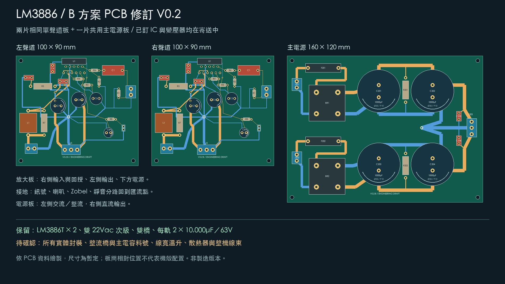

> 2026-09-18 歸檔：本版全部檔案已移至 `pcb/archive/v02/`，重建腳本移至 `tools/archive/`。僅供歷史對照，現行版本見 [pcb/README.md](../../README.md)。

# PCB B 方案修訂 V0.2

> 2026-09-17 更正：本版已發布專案實際使用 Default 網路類別 0.2 mm 間距；生成器曾把人工設定還原，因此先前文字的 0.3 mm 不準確。舊 DRC 紀錄及板檔保留。新版 V0.3 已修復並加入執行前後規則核對，詳見 [更正說明](../../review-v03.md#規則重設問題的更正)。

2026-09-17。依使用者選擇 B：保留兩片相同單聲道板＋一片共用電源板，重整布局、回流及走線。使用者確認 **LM3886T 與變壓器均仍在寄送中，尚未收到**；本版沒有已到料或實物尺寸核對的宣稱。



## 圖檔與版本

| 板子 | V0.1 → V0.2 暫定尺寸 | 數量 | 新版原始檔 | 預覽 |
|---|---|---|---|---|
| 單聲道放大板 | 90 × 80 → 100 × 90 mm | 2 | [KiCad PCB](mono-layout-v02.kicad_pcb)／[專案](mono-layout-v02.kicad_pro) | [PNG](preview/mono-layout-v02.png)／[原生 SVG](preview/mono-v02-native.svg) |
| 共用電源板 | 150 × 110 → 160 × 120 mm | 1 | [KiCad PCB](psu-layout-v02.kicad_pcb)／[專案](psu-layout-v02.kicad_pro) | [PNG](preview/psu-layout-v02.png)／[原生 SVG](preview/psu-v02-native.svg) |

本版為**已完成本輪走線及軟體檢查的工程草稿，不是製造版本**。保留 V0.1 全部 PCB、預覽、生成器與檢查紀錄，沒有覆寫舊版板子。V0.3 原理圖、元件數值及先前 PDF 不變；舊 PDF 未包含本版 PCB。

## 修改內容與依據

- 放大板把輸入與回授放在右上，輸出電感／補償放在左側，電源接頭置於下側。R4 回授從 U1 輸出腳取樣，位於輸出電感前，回授與主輸出走線分開引出。
- 原生成器的最近焊盤連接，改為 `tools/archive/pcb_layout_v02.py` 內逐段明確定義的走線。靜音與負電源的層間連通已補足，真正需要換層的位置放置實體導通孔。
- 放大板接地匯流中心為板座標 **(43, 50) mm**。訊號／回授、喇叭、Zobel、靜音、局部去耦及電源回線分路安排；銅箔在中心附近的有限面積內匯合，不是理想零阻抗點。沒有用整面 GND 覆銅把各分路重新短接。
- C3/C4 靠近 IC 供電區，C6/C7 放在板內供電路徑上。引腳引出仍受暫定 LM3886 封裝限制；到料後需再縮短及核對去耦迴路，不能據此認定高頻穩定。
- 電源板將 AC 接頭、保險絲、整流橋留在左側；主電容正負電源成對排列。充電線先進 C201/C203，再連至 C202/C204；放大板的直流電源從後一對電容端引出。正負電容組的地各自引到 **(110, 59.08) mm** 匯流中心，再到 J203。
- 電源板洩放電阻移到兩列電容間，C205/C206 在直流輸出側。J203 仍為三極接頭，左右聲道的雙線束分配與端接方式待選型，並未假設一個端子能直接塞兩條線。
- 新增獨立 `DraftV02.pretty`，以元件本體和焊盤外緣建立暫定 courtyard，保留舊版封裝庫。絲印端子標示、參考文字及極性預覽一併整理。

接地及回授安排參考 [TI LM3886 datasheet，Layout, Ground Loops and Stability，pp.21–22](https://www.ti.com/lit/ds/symlink/lm3886.pdf)。這是布局設計依據，不是對本板噪聲、振盪、失真或功率的測試結果。

## 本次檢查

2026-09-17，以官方 KiCad **10.0.6** 匯出現行兩份原理圖 netlist、產生 PCB、原生重新載入及 DRC：

| 檢查 | 放大板 | 電源板 |
|---|---:|---:|
| 原理圖對照的電氣焊盤數 | 54 | 35 |
| 銅箔線段 | 97 | 59 |
| 導通孔 | 4 | 0 |
| 原生 DRC 違規（含已啟用警告） | 0 | 0 |
| 原生 DRC 未連通項目 | 0 | 0 |

- 使用本版 `.kicad_pro` 規則：全域最小間距 0.0 mm、Default 網路類別間距 0.2 mm、最小線寬 0.2 mm、銅箔到板邊 0.50 mm、導通孔環寬 0.1 mm、絲印間距 0.0 mm。這些為草稿檢查基準，尚非板廠確認規則。
- [放大板 DRC](mono-v02-drc.json)／[電源板 DRC](psu-v02-drc.json) 保留完整機器輸出及未啟用檢查列表。
- PCB 儲存後原生重新載入，逐焊盤核對原理圖網路；3 個 IC NC 腳仍保留各自不相連的網路。
- 額外以線寬及 0.1 mm 取樣核對放大板地線分組：匯流中心半徑 4 mm 區域外未發現跨組銅箔接觸。這是幾何輔助檢查，不等於電流密度、共阻抗或穩定性模擬。[驗證摘要](validation-v02.json)
- 以原生 SVG 及 PCB 資料 PNG 檢視布局；沒有重跑或修改原理圖 ERC，沒有硬體量測。

## 尚未確定的設計條件

| 項目 | 本版處理 | 到貨／選料後的核對 |
|---|---|---|
| LM3886T | 已訂、寄送中；仍用明確標示未驗證的 11 腳封裝 | 真偽／狀態、腳距、腳列、彎腳、安裝高度、散熱片孔位 |
| 變壓器 | 已訂、寄送中；賣場標示兩組獨立 22Vac＋單 12Vac | 額定 VA、各繞組電流、實際電壓、線色與相位、尺寸固定方式 |
| 整流橋 | 2 顆未購，邏輯 AC1／AC2／P／N 占位 | 料號、實際腳序、安裝與散熱；確定前不可製板 |
| 主電容 | 4 × 10,000µF／63V 未購；Ø35、腳距 10 mm 假設 | 品牌料號、直徑／高度／腳距、紋波額定、壽命 |
| 線寬與銅厚 | 放大板主線 1.2–2.0 mm、IC 引出 0.6–0.8 mm；電源主直流線 3.0 mm、AC 線 2.0 mm | 按實際負載、峰值／充電電流、銅厚、線長及容許溫升重新核算；數字不代表已核准載流 |
| 機構 | 雙層、1.6 mm 板厚及四角 M3 孔為假設 | 全部接頭、保險絲座、電感尺寸；螺絲頭／墊片占位與機殼、散熱器干涉 |

完整封裝清單：[放大板](mono-layout-v02-footprints.csv)／[電源板](psu-layout-v02-footprints.csv)。本版維持約 ±30V 等級的設計假設；沒有把 200W 賣場標示當成已驗證 VA，沒有重新宣告輸出功率。

LM3886T 背板與負電源的關係及絕緣結構仍須核對。市電一次側、浪湧限制、12Vac 輔助電源、啟停監控和喇叭 DC 保護不在這兩片 PCB 內；本版輸出仍為板級假負載測試介面。沒有 Gerber 或可製造聲明。

## 重建

需要 KiCad 10 CLI、含 `pcbnew` 的 KiCad Python，以及執行 PNG 繪圖用的 Pillow。指令從專案根目錄執行；`python3` 應指向能匯入 `pcbnew` 的環境。

```sh
kicad-cli sch export netlist --format kicadxml -o electrical/netlist.xml electrical/lm3886-v01.kicad_sch
kicad-cli sch export netlist --format kicadxml -o electrical/psu-netlist.xml electrical/internal-psu-v02.kicad_sch
python3 tools/archive/build_pcb_v02.py
kicad-cli pcb drc --format json --exit-code-violations -o pcb/mono-v02-drc.json pcb/mono-layout-v02.kicad_pcb
kicad-cli pcb drc --format json --exit-code-violations -o pcb/psu-v02-drc.json pcb/psu-layout-v02.kicad_pcb
python3 tools/archive/verify_pcb_v02.py
python3 tools/archive/render_pcb_v02.py
kicad-cli pcb export svg --layers F.Cu,B.Cu,F.SilkS,Edge.Cuts --mode-single --fit-page-to-board --exclude-drawing-sheet -o pcb/preview/mono-v02-native.svg pcb/mono-layout-v02.kicad_pcb
kicad-cli pcb export svg --layers F.Cu,B.Cu,F.SilkS,Edge.Cuts --mode-single --fit-page-to-board --exclude-drawing-sheet -o pcb/preview/psu-v02-native.svg pcb/psu-layout-v02.kicad_pcb
```

PNG 支援 macOS 黑體及 Windows 微軟正黑體；其他環境以 `LM3886_FONT` 指向可用的中文字型。PNG 與原生 SVG 都是頂視圖，合併顯示兩層銅箔，不能直接當背面蝕刻圖。

本版來源為 `tools/archive/pcb_layout_v02.py`（位置／連線）與 `tools/archive/build_pcb_v02.py`（生成）；手動改 PCB 前請另存新版本，否則重建會覆寫 V0.2。`tools/archive/build_pcb_draft.py` 仍只重建歷史 V0.1。
