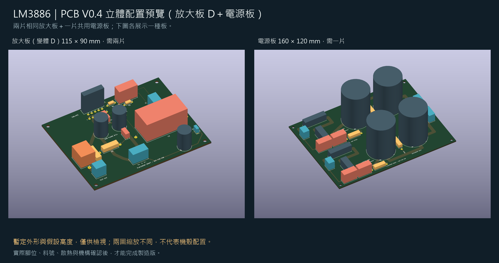

# PCB V0.4：正反面、組裝、3D 與零件核對

2026-09-24，依 `main` `2e31133` 的 PCB V0.4 製作：**放大板變體 D**（底層整面接地，使用者選定的主要方案）與**電源板 V0.4**（每聲道一組輸出端子、每繞組 snubber 預留位）。變體 C 的板檔保留在 `pcb/mono-layout-v04c.*`，本套圖沒有畫它。做法、限制與 [V0.3 那套](../inspection-v03/README.md) 相同；**沒有改變原理圖、PCB 走線、元件值或採購狀態**。這是一套工程審查資料，尚不可送廠。



## A：正反面與組裝圖

兩片單聲道板完全相同，因此提供一套放大板圖與一套電源板圖。

| 圖面 | 單聲道板（D）×2 | 電源板 ×1 |
|---|---|---|
| 正面銅箔 F.Cu | [PNG](drawings/mono-top.png)／[SVG](drawings/mono-top.svg) | [PNG](drawings/psu-top.png)／[SVG](drawings/psu-top.svg) |
| 背面銅箔 B.Cu | [PNG](drawings/mono-bottom.png)／[SVG](drawings/mono-bottom.svg) | [PNG](drawings/psu-bottom.png)／[SVG](drawings/psu-bottom.svg) |
| 正面組裝／極性圖 | [PNG](drawings/mono-assembly.png)／[SVG](drawings/mono-assembly.svg) | [PNG](drawings/psu-assembly.png)／[SVG](drawings/psu-assembly.svg) |
| 值、接頭用途、逐腳網路 | [對照表](drawings/mono-assembly-notes.md) | [對照表](drawings/psu-assembly-notes.md) |
| KiCad 原生銅箔匯出 | [正面](native/mono-top.svg)／[背面](native/mono-bottom.svg) | [正面](native/psu-top.svg)／[背面](native/psu-bottom.svg) |

**觀看方向：**正面圖從元件側看；背面銅箔圖相對正面左右鏡像，等於沿垂直軸把板子翻過來。背面圖中的元件編號只是對位註解，不表示元件裝在背面。原生背面 SVG 同樣使用 KiCad `--mirror`。沒有提供製板底片或保證 1:1 列印的加工圖。

**放大板 D 的背面圖**：暗藍色整面是 GND 鋪銅（KiCad 填銅結果，單一連通區），焊盤周圍的深色環是熱阻隔間隙；淺藍線是底層非接地走線（C7→pin 1 的 V+、pin 4 的 V- 進腳、回授取樣線），它們把鋪銅切出的縫就是圖上看到的深色細線。電源板沒有鋪銅，背面仍是 4 mm 接地與交流走線。

組裝圖的 `1 +`／`2 -` 表示有極性電解的正負焊盤。C2 是無極性電容，不加正負標記。C6、C8、C203／C204 的**正端在 GND**，不能把所有 GND 一律當成電容負端。BR1／BR2 是 4 位螺絲端子（KBPC2510 鎖在機殼上，四條 Faston 線接進來），AC1／AC2／P／N 是端子功能名稱。C207–C210、R203／R204 是 snubber 預留位，**只留孔不填料**，值等變壓器實測振鈴再定。

左右聲道實體板都使用 U1、R1、C1 等同一套絲印；右聲道對應 U2、R101、C101 等原理圖編號，見 [原理圖對照](../mono-channel-mapping.csv)。

## B：PCB 3D 預覽

| 角度 | 單聲道板（D） | 電源板 |
|---|---|---|
| 斜視 | [PNG](3d/mono-isometric.png) | [PNG](3d/psu-isometric.png) |
| 正面 | [PNG](3d/mono-top.png) | [PNG](3d/psu-top.png) |
| 背面 | [PNG](3d/mono-bottom.png) | [PNG](3d/psu-bottom.png) |

**可旋轉的 KiCad 預覽板不入版控。** 先執行 `python3 tools/build_pcb_inspection_v04.py`（純 Python 標準庫，不需 KiCad），它會產生 `3d/models/*.wrl` 與 `3d/*-preview.kicad_pcb/.kicad_pro`；再用 KiCad 開啟 preview 專案，「檢視 → 3D 檢視器」即可旋轉縮放。模型以 `${KIPRJMOD}/models/…` 相對路徑連結，`models/` 要留在 preview 板旁邊。

原 PCB 沒有修改；另產生的 preview 板只新增 3D 模型引用。外框高度沿用 V0.3 的假設值表（2026-09-22 已把 WIMA、LM3886T、CDE A05 改成型錄值，其餘仍是假設），詳見核對表；不是原廠 CAD，也不是保證能容納實物的最大外框。模型沒有表達 IC 真正彎腳及背板、電感繞線、接頭插線口、螺絲工具空間、保險絲夾、散熱器或焊錫。板厚 1.6 mm 及四角固定孔仍是設計假設。3D 圖有助於討論配置，但不能據此宣稱無干涉或散熱合格。沒有 STEP、Gerber 或鑽孔製造包。

原生算繪的未加框 PNG（`3d/raw-*.png`）是 `export_pcb_inspection_v04.py` 的中間產物，**不入版控**；上表是加了假設說明框的版本。

## C：零件與封裝核對

[完整核對表](parts-audit.md) 按板上編號列出元件值、暫定外形、假設高度、腳距、孔徑、採購狀態與選料優先順序。[JSON](parts-audit.json) 另含每個焊盤的本地座標與網路。**採購狀態欄的文字沿用 2026-09-22 的版本**，之後的量測與到貨以 [docs/00](../../docs/00-採購總表.md) 為準；V0.4 新增的 J204 與六個 snubber 預留位已加註。

## 檢查與來源

- [來源 SHA-256](sources.json)：`mono-layout-v04d`／`psu-layout-v04` 的 PCB、專案與走線 JSON。
- [本輪核對結果](verification.json)：preview 板刪除模型節點後與原板語法樹一致；22＋22 個模型、外框尺寸與 54＋50 焊盤位置／網路對照通過。雜湊表**不含**可重建中間產物（models／preview 板／raw PNG），跑 `verify_pcb_inspection_v04.py` 前要先重建它們。
- [KiCad 匯出紀錄](native-export-log.json)：四份原生銅箔 SVG 與六張 3D 算繪。
- 既有 PCB V0.4 的 DRC／網路驗證見 [上層說明](../README.md)。本輪沒有改走線，沒有新增 ERC／DRC 或實機測試；不把 3D 顯示當作電氣驗證。

## 重建

依序執行（Python 3、KiCad 10 CLI；PNG 需 PyMuPDF 與 Pillow，不再需要 node／sharp）：

```sh
python3 tools/build_pcb_inspection_v04.py
python3 tools/write_pcb_parts_audit_v04.py
python3 tools/render_pcb_inspection_v04.py
python3 tools/export_pcb_inspection_v04.py --cli kicad-cli
python3 tools/frame_pcb_inspection_v04.py
# 使用能匯入 pcbnew 的 KiCad Python：
python3 tools/verify_pcb_inspection_v04.py
```

中文圖片字型：macOS 用 STHeiti，Windows 預設微軟正黑體（`msjh.ttc`），或以 `LM3886_FONT` 指定字型檔。若電路或封裝改動，需先依主專案流程重建與檢查，再重製本套圖面；不得把本資料夾的 preview 板當成後續電路來源。
